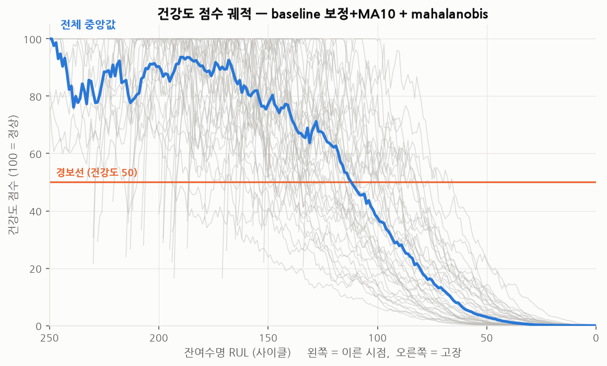
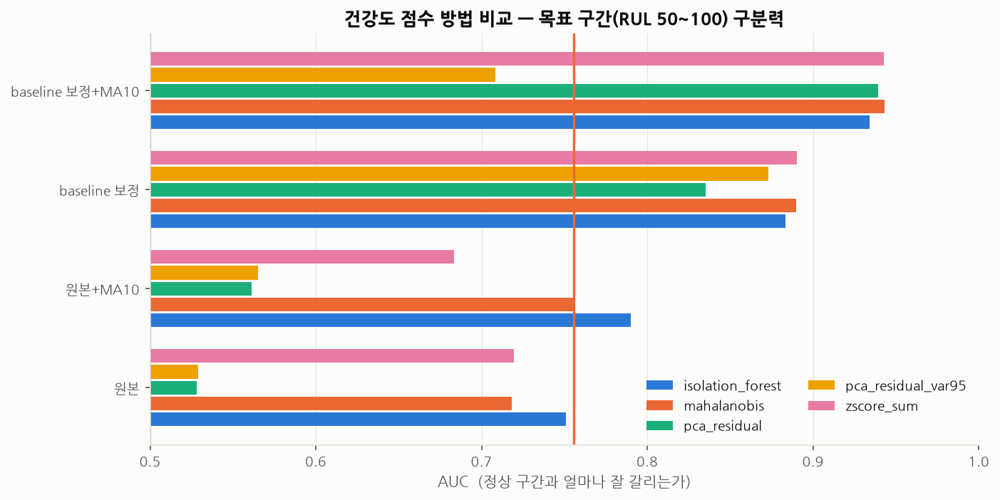
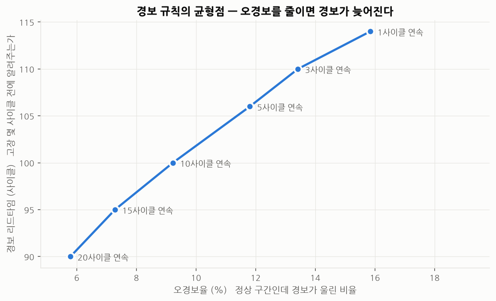

# 설비 예지보전 (Predictive Maintenance)

> **"설비가 실제로 고장나기 전에, 데이터로 미리 알아챌 수 있는가?"**
>
> 센서 데이터로 설비의 열화를 추적하고, 고장 전에 경보를 낼 수 있는지 검증하는 프로젝트입니다.

기계직/시설관리(FM) 실무 경험을 데이터 분석으로 확장하는 세 번째 프로젝트입니다.

| # | 프로젝트 | 질문 |
|---|----------|------|
| 1 | 에너지 절감 포인트 발굴 | 어디서 전기요금이 새고 있는가? |
| 2 | 업무 자동화 통합 대시보드 | 반복 보고 업무를 자동화할 수 있는가? |
| **3** | **설비 예지보전 (이 저장소)** | **고장을 미리 알아챌 수 있는가?** |

---

## 진행 상황

- [x] **0단계** 프로젝트 구조 설계, 가상환경, 데이터셋 선정 및 확보
- [x] **1단계** EDA — 센서 패턴 관찰, 정상/열화 구간 시각화 → [결과](docs/02_eda.md)
- [x] **2단계** 건강도 점수 (Health Index) — 정상 범위에서 얼마나 벗어났는가 → [결과](docs/03_health_index.md)
- [ ] **3단계** RUL(잔여수명) 예측 모델 — 여러 방법 비교
- [ ] **4단계** MetroPT-3(실제 압축공기 설비)로 전이 검증
- [ ] **5단계** 실무 적용 방안 정리

> 현재 2단계 완료. 이 README 는 진행에 따라 계속 갱신됩니다.

---

## 1. 문제 정의

설비 관리 방식은 크게 세 단계로 발전합니다.

| 방식 | 언제 고치나 | 문제점 |
|------|-------------|--------|
| 사후보전 (BM) | 고장난 뒤에 | 예고 없는 정지, 2차 피해 |
| 예방보전 (PM) | 정해진 주기마다 | 멀쩡한 부품도 교체 → 비용 낭비 |
| **예지보전 (PdM)** | **징후가 보일 때** | **데이터와 모델이 필요** |

현장에서 예방보전이 표준인 이유는 안전하기 때문이지만, 그 대가로
"아직 쓸 수 있는 부품"을 버리고 있습니다.
이 프로젝트는 그 판단을 **데이터로 대체할 수 있는지**를 검증합니다.

구체적으로 두 가지 산출물을 목표로 합니다.

1. **건강도 점수 (Health Index)** — 지금 상태가 정상 범위에서 얼마나 벗어났는가 (0~100)
2. **잔여수명 예측 (RUL)** — 앞으로 얼마나 더 쓸 수 있는가

---

## 2. 데이터

### 메인: NASA C-MAPSS (Turbofan Engine Degradation Simulation)

항공기 터보팬 엔진을 물리 시뮬레이터로 **고장까지** 운전시킨 데이터.
예지보전 분야의 표준 벤치마크입니다.

| 세트 | train 행 | test 행 | 엔진 수 (train/test) | 운전조건 | 고장모드 |
|------|---------:|--------:|:--------------------:|:--------:|:--------:|
| FD001 | 20,631 | 13,096 | 100 / 100 | 1 | 1 |
| FD002 | 53,759 | 33,991 | 260 / 259 | 6 | 1 |
| FD003 | 24,720 | 16,596 | 100 / 100 | 1 | 2 |
| FD004 | 61,249 | 41,214 | 249 / 248 | 6 | 2 |

- 센서 21개 + 운전조건 3개, 엔진마다 초기 마모 상태가 제각각
- train 은 고장까지 완주, test 는 고장 전에 기록이 끊김 (정답 RUL 별도 제공)

### 전이 검증용: MetroPT-3 (지하철 공기압축기 실측)

실제 공기압축기 유닛에서 1초 간격으로 수집한 **실측** 데이터(약 1,516만 행).
압축기 토출압력, 오일 온도, 모터 전류 등 — **공조/유틸리티 설비와 물리적으로 거의 동일**합니다.

> 후보 3개를 비교하고 AI4I 2020 을 탈락시킨 근거, 센서 21개의 물리적 의미,
> 도메인 차이에 대한 상세 논의는 **[docs/01_dataset_selection.md](docs/01_dataset_selection.md)** 에 정리했습니다.

---

## 3. 항공기 엔진 데이터로 시설관리를 말할 수 있는가

이 프로젝트의 가장 정직하게 다뤄야 할 지점입니다.

### 방법론은 설비 종류가 아니라 데이터 구조에 의존한다

예지보전 알고리즘이 요구하는 것은 엔진의 물리가 아니라 **데이터의 형태**입니다.

| 알고리즘이 요구하는 것 | 항공기 엔진 | 공조기 / 펌프 |
|---|---|---|
| 다변량 시계열 | 센서 21개 | 온도·압력·유량·전류·진동 |
| 개체 단위 이력 | 엔진 1기 | 공조기 1호기 |
| 시간축 | 운전 사이클 | 운전 시간 |
| 운전조건 변동 | 고도·마하수·스로틀 | 외기온·부하율·인버터 주파수 |
| 열화 메커니즘 | 압축기 효율 저하 | 필터 막힘, 임펠러 마모, 베어링 열화 |

이 프로젝트는 `config/config.yaml` 에서 **경로와 컬럼 이름만 바꾸면**
다른 설비 데이터로 전환되도록 설계했습니다.

### 물리 현상이 실제로 같다

터보팬 엔진의 고압 압축기와 냉동기의 원심 압축기는 같은 원리로 유체를 압축합니다.
C-MAPSS 의 주 고장모드인 **HPC Degradation(압축기 효율 저하)** 은
"같은 회전수인데 토출압이 안 나오고 토출온도가 올라가는" 현상입니다.

이것은 **냉동기 압축기 성능 저하, 펌프 임펠러 마모와 같은 신호 패턴**입니다.
EDA 에서 실제로 확인한 두 가지가 시설관리 지표와 직접 대응합니다.

- **터빈 출구 온도(T50) 상승** (ρ=+0.77) — 항공 정비에서 **EGT 마진 감소**라 부르며
  엔진 교체 판단의 핵심 근거입니다. 냉동기의 **토출가스 온도 상승**,
  펌프의 **모터 권선 온도 상승**과 같습니다. "같은 일을 하는데 더 뜨거워진다."
- **팬/코어 회전수 상승** (ρ=+0.68) — 성능을 유지하려고 더 빨리 돌리는 것으로,
  공조기 **필터 막힘 시 인버터 주파수·전류 상승**과 정확히 같은 패턴입니다.

### 오히려 더 어려운 조건에서 검증한다

FD004 는 운전조건 6가지 × 고장모드 2가지가 섞여 있습니다.
대부분의 건물 설비는 이보다 운전 패턴이 단순합니다.

### 한계도 분명히 있다

| 차이 | 내용 | 이 프로젝트의 대응 |
|------|------|--------------------|
| 시뮬레이션 vs 실측 | C-MAPSS 엔 결측·센서고장·통신두절이 없음 | 4단계에서 MetroPT-3 실측 데이터로 검증 |
| **고장 이력 부재** | 실제 설비는 예방정비로 고장 전에 교체 → run-to-failure 데이터가 없음 | **정상 데이터만으로 학습하는 이상탐지 방식을 병행** |
| 시간 해상도 | 1 사이클 = 비행 1회 vs BAS 1~15분 | 절대 시간이 아닌 **수명 대비 진행률(%)** 로 정규화 |

**두 번째 항목이 이 프로젝트의 핵심 메시지입니다.**

| 접근 | 필요한 것 | 현장 적용성 |
|------|-----------|-------------|
| RUL 회귀 (지도학습) | 고장 이력 다수 | 낮음 — 실제로 그런 데이터가 없음 |
| **이상탐지 + 건강도 점수** (비지도) | **정상 데이터만** | **높음 — 어느 현장에나 있음** |

RUL 회귀는 방법론이 제대로 작동하는지 **검증하기 위한 벤치마크**이고,
실제로 회사에 들고 갈 수 있는 것은 **이상탐지 쪽**입니다.
이 프로젝트는 두 갈래를 모두 구현하고, 그 차이를 명확히 기록합니다.

---

## 4. 1단계 결과 — EDA 로 알아낸 것

> 재현: `python scripts/01_eda.py` · 전체 분석: **[docs/02_eda.md](docs/02_eda.md)**

### 같은 기종인데 수명이 2.8배 차이 난다


엔진 100대의 수명이 **128 ~ 362 사이클**로 흩어져 있습니다.
가장 짧은 수명에 맞춰 일괄 교체하면 **평균 수명의 38%를 버립니다.**
평균에 맞추면 절반 가까이가 그 전에 고장납니다.

주기 기반 교체는 **낭비 아니면 사고** 중 하나를 고르는 문제입니다.
이 프로젝트의 존재 이유가 이 그림 한 장에 들어 있습니다.
(공조기 필터를 "3개월마다" 교체하는 것과 같은 구조입니다)

### 센서 21개 중 14개만 신호를 담고 있다


7개는 값이 전혀 변하지 않아 제외했습니다.
남은 14개는 모두 뚜렷한 단조 추세를 보이며, 그 움직임은 물리로 설명됩니다 —
압축기 효율이 떨어지자 제어기가 회전수를 올리고, 그 결과 배기 온도가 올라갑니다.

### 그리고 이것이 진짜 문제다


| 언제 판단하는가 | 구분력 (AUC) | 평가 |
|---|---|---|
| 고장 30사이클 전 | **0.994** | 거의 완벽 — 그러나 **이미 늦음** |
| 고장 100사이클 전 | **0.622** | **사실상 못 잡음** |

**고장 임박을 맞히는 것은 쉽습니다. 일찍 알아채는 것이 어렵습니다.**

원인을 숫자로 추적한 결과, 노이즈가 아니라 **개체차**가 주범이었습니다.
엔진마다 정상 상태의 출발점 자체가 다르고,
그 **개체 간 편차가 전체 열화폭의 77%** 를 차지합니다.
어떤 설비의 센서값이 높다는 사실만으로는
"열화된 것"인지 "원래 높게 출발한 것"인지 알 수 없습니다.

> 고정 임계값 경보("토출온도 80℃ 넘으면 알람")가
> 설비마다 잘 안 맞는 이유가 정확히 이것입니다.

**따라서 2단계의 목표는 "AUC 0.99 달성"이 아니라
"RUL 50~100 구간의 낮은 점수를 다변량 결합으로 얼마나 올리는가"가 됩니다.**
쉬운 구간은 이미 천장에 닿아 있어 개선 여지가 없습니다.

---

## 5. 2단계 결과 — 건강도 점수

> 재현: `python scripts/02_health_index.py` · 전체 분석: **[docs/03_health_index.md](docs/03_health_index.md)**

**핵심 제약을 먼저 걸었습니다: 고장 라벨을 전혀 쓰지 않습니다.**
학습에 쓰는 것은 **설비별 초기 30사이클(정상 구간)** 뿐입니다.
실제 회사 설비에는 "고장까지 돌린 기록"이 없지만 **정상 운전 데이터는 어디에나 있기** 때문입니다.
이 제약을 지켜야 만든 것이 현장으로 넘어갈 수 있습니다.

### 결과

| 항목 | 결과 |
|---|---|
| 목표 구간(RUL 50~100) 구분력 | **AUC 0.943** (센서 1개일 때 0.756) |
| 경보 리드타임 | 고장 **114 사이클 전** (중앙값), 최악의 경우도 82 사이클 전 |
| 경보를 놓친 설비 | **0 / 100대** |
| 오경보율 | 15.8% → 지속 조건 적용 시 **5.8%** |

평균 수명이 206 사이클이므로 **수명의 절반 이상이 남은 시점에 알려주는** 셈입니다.



### 개선의 대부분은 모델이 아니라 전처리에서 나왔다

전처리 2가지 × 결합 방법 5가지 = **20가지 조합**을 같은 조건에서 비교했습니다.



| 무엇을 바꿨나 | 변화 |
|---|---|
| 모델만 교체 (z점수 평균 → 마할라노비스, 원본 그대로) | 0.719 → 0.718 (**변화 없음**) |
| 전처리만 교체 (원본 → 개체 baseline 보정 + 이동평균) | 0.719 → **0.943** |

1단계 EDA 에서 "개체차가 열화폭의 77%"를 미리 확인해 뒀기 때문에
어디를 손봐야 할지 알 수 있었습니다. **분석 순서를 지킨 것이 성능으로 돌아왔습니다.**

그리고 가장 정교한 모델(마할라노비스)과 가장 단순한 방법(z점수 평균)이 **동점(0.943)** 이었습니다.
성능이 같다면 **현장에서 설명할 수 있는 쪽**이 낫습니다 —
z점수 평균은 "어느 센서가 몇 표준편차 벗어나서 이 점수가 나왔다"를 그대로 보여줍니다.

### 오경보는 기술 문제가 아니라 선택의 문제다



"건강도 50 미만이 N사이클 연속될 때만 경보"라는 지속 조건을 걸면
오경보를 15.8% → 5.8% 로 줄일 수 있지만, 그 대가로 **리드타임 24사이클을 잃습니다.**

어느 지점을 고를지는 기술이 아니라 **경영 판단**입니다.
정지 손실이 큰 설비는 예민하게, 여유 설비가 있으면 둔감하게 잡으면 됩니다.
이 표를 그대로 관리자에게 보여주고 고르게 하는 것이 실무적인 방식이라고 봅니다.

---

## 6. 빠른 시작

```bash
# 1) 저장소 클론
git clone https://github.com/Hyun-Moon/Predictive-Maintenance.git
cd Predictive-Maintenance

# 2) 가상환경 생성 및 활성화
python -m venv .venv
source .venv/bin/activate        # Windows: .venv\Scripts\activate

# 3) 패키지 설치
pip install -r requirements.txt

# 4) 데이터 다운로드 (약 12MB, 자동)
python -m src.data.download --dataset cmapss

# 5) 정상 동작 확인
pytest -q                        # 33개 통과하면 정상
python -m src.data.load          # 데이터 요약 출력
```

<details>
<summary>4번에서 다운로드가 막히는 경우 (사내망/방화벽)</summary>

스크립트가 자동으로 수동 다운로드 절차를 안내합니다.
[Kaggle 미러](https://www.kaggle.com/datasets/behrad3d/nasa-cmaps)에서 받아
`data/raw/cmapss/CMAPSSData/` 에 풀고 아래로 확인하세요.

```bash
python -m src.data.download --dataset cmapss --check-only
```
</details>

<details>
<summary>가상환경(venv)이 뭔가요?</summary>

프로젝트마다 **독립된 파이썬 패키지 창고**를 따로 두는 기능입니다.

A 프로젝트는 pandas 1.5 가 필요하고 B 프로젝트는 pandas 2.1 이 필요할 때,
컴퓨터 전체에 하나만 깔면 둘 중 하나는 반드시 깨집니다.
가상환경을 쓰면 프로젝트 폴더 안(`.venv/`)에 그 프로젝트 전용 패키지만 담기므로
서로 간섭하지 않습니다.

`.venv/` 는 용량이 크고 OS마다 내용이 달라서 git 에 올리지 않습니다.
대신 `requirements.txt` 만 올려두면 누구나 똑같은 환경을 재현할 수 있습니다.
</details>

---

## 7. 프로젝트 구조

```
Predictive-Maintenance/
├── config/
│   └── config.yaml              # 경로·컬럼명·하이퍼파라미터 (설비 교체 시 여기만 수정)
├── data/                        # git 에 올라가지 않음 (.gitignore)
│   ├── raw/                     #   다운로드 원본 (절대 수정하지 않음)
│   ├── interim/                 #   중간 가공본
│   └── processed/               #   모델 입력용 최종본
├── docs/
│   ├── 01_dataset_selection.md  # 데이터셋 비교·선정 근거
│   ├── 02_eda.md                # 1단계 EDA 분석 결과
│   ├── 03_health_index.md       # 2단계 건강도 점수 결과
│   └── 99_experiments_log.md    # 시도/실패/배운 것 실시간 기록
├── notebooks/                   # 자유 탐색용 (정식 분석은 scripts/ 에)
├── reports/
│   ├── figures/                 # README 에 쓰는 그림 (스크립트로 재생성 가능)
│   └── metrics/                 # 분석 수치 CSV
├── scripts/
│   ├── 01_eda.py                # 1단계 EDA — 그림·수치 전부 생성
│   └── 02_health_index.py       # 2단계 건강도 점수 — 20가지 조합 비교
├── src/
│   ├── config.py                # 설정 로더
│   ├── data/
│   │   ├── download.py          # 데이터셋 자동 다운로드 (미러 다중화 + 수동 안내)
│   │   └── load.py              # 원본 txt → RUL 라벨이 붙은 DataFrame
│   ├── features/
│   │   ├── select.py            # 정보 없는 컬럼 걸러내기
│   │   └── health.py            # 설비별 baseline 보정, 이동평균
│   ├── models/
│   │   └── health_index.py      # 이상탐지 5종 + 0~100 점수 변환 + 경보 규칙
│   └── viz/
│       └── style.py             # 그림 색·스타일 공통 설정
├── tests/
│   ├── test_data_load.py        # 데이터 무결성 검증 13개
│   └── test_health_index.py     # 건강도 점수 동작 검증 20개
├── requirements.txt             # 기본 패키지
├── requirements-deep.txt        # PyTorch (3단계에서만 필요)
└── requirements.lock.txt        # 실제 설치된 정확한 버전
```

**설계 원칙**

- `data/raw` 는 **읽기 전용**으로 취급합니다. 원본을 덮어쓰면 재현이 불가능해집니다.
- 경로·컬럼명을 코드에 하드코딩하지 않고 `config.yaml` 로 뺐습니다.
  → 실제 회사 설비 데이터로 갈아끼울 때 코드를 거의 고치지 않아도 됩니다.
- 데이터는 git 에 올리지 않고 **다운로드 스크립트로 재현**합니다.
  (용량·라이선스 문제 회피 + 누구나 같은 데이터 확보 가능)
- 분석을 노트북이 아니라 **스크립트**로 씁니다.
  노트북은 실행 순서에 따라 결과가 달라지고 git 에서 변경 내역을 읽기 어렵습니다.
  `python scripts/01_eda.py` 한 줄로 모든 그림과 수치가 **같은 결과로** 다시 만들어집니다.

---

## 8. 시도했지만 실패한 것들

성공한 결과만 있는 분석은 "운이 좋았는지 실력인지" 구분되지 않습니다.
무엇을 왜 버렸는지를 기록합니다. **전체 기록: [docs/99_experiments_log.md](docs/99_experiments_log.md)**

현재까지의 주요 항목:

**AI4I 2020 데이터셋 검토 후 탈락**
예지보전 입문용으로 가장 많이 보이는 데이터셋이지만, 각 행이 독립된 스냅샷이라
개체 번호도 시간축도 없었습니다. 이 데이터로는 RUL 을 정의할 수조차 없습니다.
→ *예지보전이라는 이름이 붙어 있다고 다 시계열이 아니다.
`(개체 ID, 시간, 센서)` 세 축이 다 있는지부터 확인해야 한다.*

**NASA 공식 문서의 오류**
공식 `readme.txt` 의 FD004 개체 수(train 248 / test 249)를 그대로 테스트에 넣었다가 실패.
실제 파일은 **train 249 / test 248** 이었습니다.
`RUL_FD004.txt` 의 행 수(248)가 test 개체 수와 일치하는 것으로 교차 확인했습니다.
→ *공식 문서라도 데이터로 검증한다. 그리고 검증 결과를 테스트 코드에 박아둔다.*

**원본 파싱 시 컬럼이 26개가 아니라 28개**
`sep=" "` 로 읽었더니 뒤에 전부 NaN 인 컬럼 2개가 생겼습니다.
원인은 원본 파일의 **각 줄 끝에 붙은 공백 2개**였습니다.
→ *공백 구분 텍스트는 `sep=r"\s+"` 를 쓴다. 그리고 파싱 직후 컬럼 수를 검사한다.*

**"AUC 0.99" 를 성과로 착각할 뻔함 — 가장 값진 실패**
정상 구간과 고장 임박 구간을 센서 하나로 구분해 AUC 0.994 를 얻고
처음엔 좋은 결과로 기록하려 했습니다. 그런데 두 구간이 시간상 너무 멀리 떨어져 있어
**문제를 쉽게 만들어놓고 잘 풀었다고 한 셈**이었습니다.
게다가 고장 30사이클 전에 알아채는 것은 실무에서 이미 늦습니다.
→ *평가 설정이 성능 숫자보다 먼저다. 다시 설계하니 진짜 성적표는 **AUC 0.62** 였다.*

**노이즈 제거로 조기 탐지를 개선하려다 실패**
조기 탐지가 안 되는 원인이 센서 노이즈라고 보고 이동평균을 걸었지만
AUC 가 0.624 → 0.640 으로 거의 움직이지 않았고, 창을 키우면 오히려 나빠졌습니다.
나중에 재보니 신호가 노이즈보다 이미 **6~8배** 컸습니다. 노이즈는 주범이 아니었습니다.
→ *원인을 진단하기 전에 대책부터 적용하지 말 것.*

**PCA 재구성오차가 완전히 실패 — 원인은 흔히 쓰는 기본값이었다**
주성분 개수를 관행대로 "분산의 95%를 담는 만큼"으로 뒀더니 **AUC 0.529**,
동전던지기 수준이었습니다. 확인해 보니 14개 중 **12~13개 주성분**이 선택되어
사실상 압축을 안 하고 있었습니다. 압축을 안 하면 무엇을 넣어도 그대로 복원되니
재구성 오차에 이상 신호가 남지 않습니다.
주성분을 **1~2개로 강하게 제한**하자 **0.940** 으로 뒤집혔습니다.
→ *관행적인 기본값이 가장 위험한 설정일 수 있다.
   성능이 이상하면 지표만 보지 말고 모델이 내부에서 무엇을 하는지 찍어봐야 한다.*

**건강도 점수 스케일 오설계 — 멀쩡한 설비가 75점에서 시작함**
`HI = 100 × 0.5^(d / d_경보)` 로 만들었는데, 궤적을 그려 보니
정상 구간이 100점이 아니라 **75점에서 출발**했습니다.
정상 상태의 거리가 0 이 아니라 중앙값 2.82 였기 때문입니다.
기준점을 두 개(정상 중앙값 → 100, 경보 지점 → 50)로 바꿔 해결했습니다.
→ *AUC 는 순위만 보는 지표라 이 문제를 전혀 잡아내지 못했다.
   숫자만 보지 말고 궤적을 그려봐야 한다.*

**"오경보율 15.8%"를 그냥 실패로 적을 뻔함**
너무 높아 실패로 기록하려다, 구간별 점수를 찍어보니
"정상"이라 라벨한 구간 안에서도 점수가 이미 오르고 있었습니다
(학습구간 2.82 → 정상평가 cycle 61+ 5.67).
RUL 125 라는 경계는 편의상 정한 값이지 물리적 경계가 아닙니다.
→ *지표가 나쁘면 모델부터 의심하지 말고 라벨 정의가 타당한지 먼저 본다.
   다만 정당화하고 넘어가지 않고, 지속 조건으로 5.8%까지 낮추는
   트레이드오프 표를 만들어 선택은 현장이 하도록 남겼다.*

**개체 baseline 보정 — 절반만 성공**
진짜 원인이 개체차(열화폭의 77%)임을 확인하고 설비별 초기값 대비 편차로 바꿨더니
RUL 50~75 구간은 0.819 → 0.866 으로 올랐지만,
가장 이른 RUL 100~125 구간은 **0.614 → 0.616 으로 그대로**였습니다.
→ *전처리로 없앨 수 있는 것은 **가려진 신호**이지 **없는 신호**가 아니다.
   그 시점에는 물리적으로 열화가 아직 일어나지 않았다.
   덕분에 이 프로젝트의 현실적인 탐지 한계를 RUL 75~100 부근으로 정직하게 잡을 수 있었다.*

**1단계 결론 하나를 2단계에서 뒤집음 — 이동평균**
1단계에서 이동평균 효과가 거의 없어(0.624 → 0.640) "노이즈는 주범이 아니다"라고 썼는데,
2단계에서 **개체차를 먼저 보정한 뒤** 같은 이동평균을 걸자 0.890 → **0.943** 으로 개선됐습니다.
→ *전처리 기법의 효과는 단독으로 평가하면 안 된다. **적용 순서에 따라 결론이 뒤집힌다.**
   1단계 문서에 수정 내역을 남겨 뒀다.*

---

## 9. 실무 적용 방안 (예정)

4단계까지 마친 뒤, 실제 회사 설비(공조기·펌프·냉동기)에 적용한다면
어떤 데이터를 어떻게 모아 어떤 순서로 확장할 수 있을지 정리합니다.

다룰 내용:
- BAS/BEMS 에서 실제로 뽑을 수 있는 태그와 최소 요구 사양
- 고장 이력이 없는 상태에서 시작하는 방법 (정상 데이터 기반 이상탐지)
- 경보 임계값 설정과 오경보(false alarm) 비용의 트레이드오프
- 정비 이력(CMMS)과 센서 데이터를 연결하는 방법
- 단계별 도입 로드맵

---

## 10. 참고

- Saxena et al., *"Damage Propagation Modeling for Aircraft Engine Run-to-Failure Simulation"*, PHM08
- [NASA PCoE Prognostics Data Repository](https://www.nasa.gov/intelligent-systems-division/discovery-and-systems-health/pcoe/pcoe-data-set-repository/)
- [MetroPT-3 Dataset (UCI)](https://archive.ics.uci.edu/dataset/791/metropt+3+dataset)
