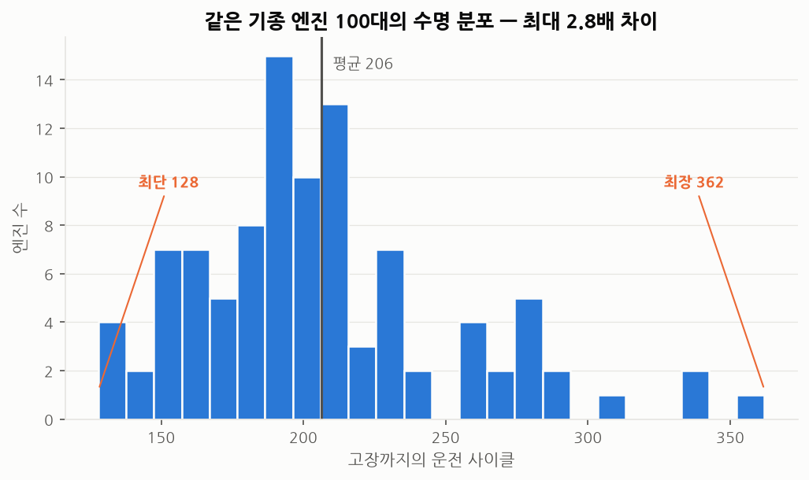
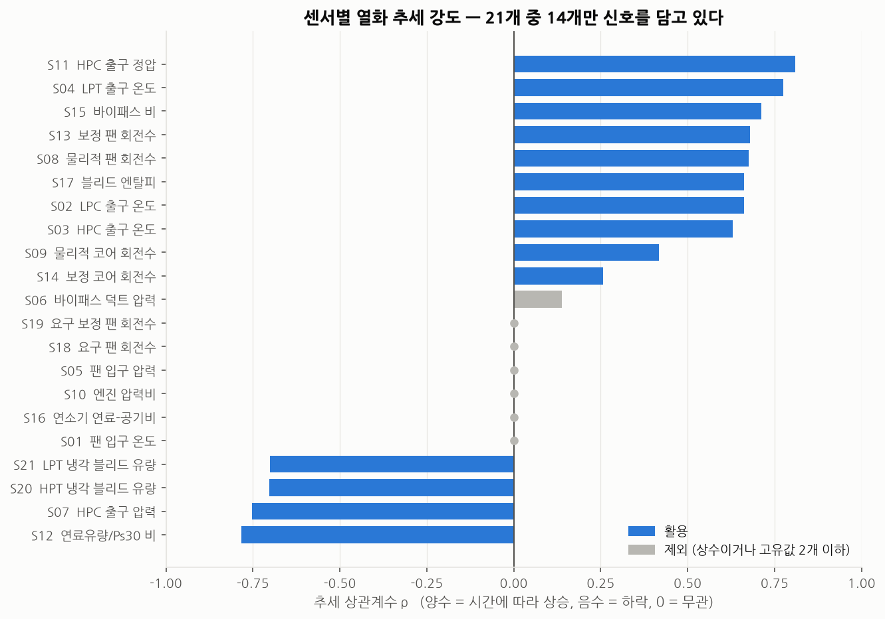
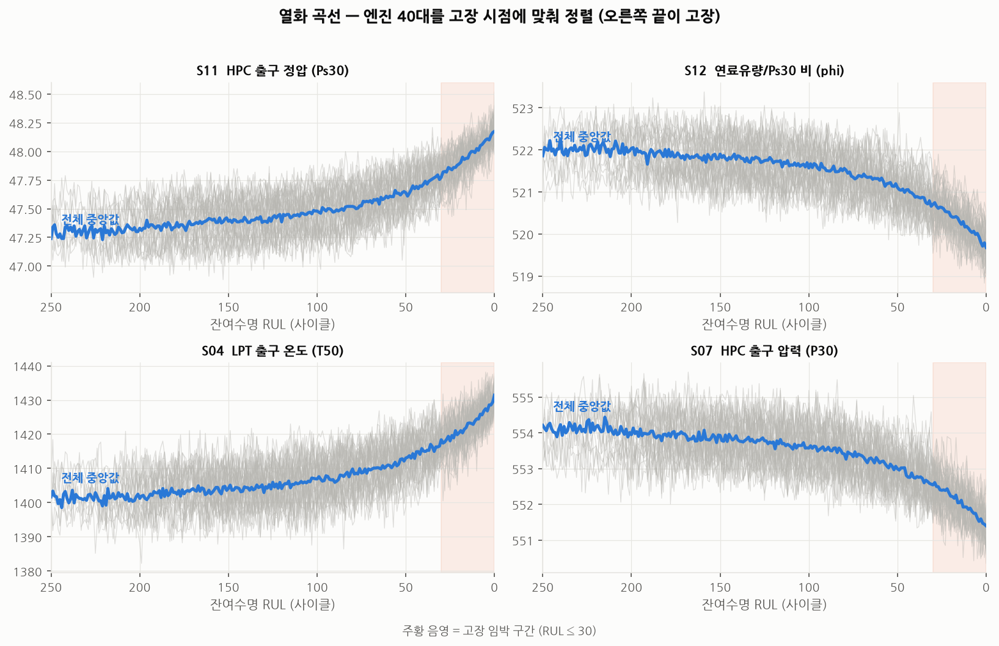
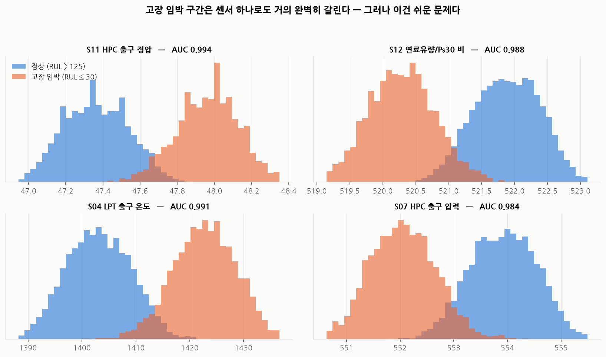
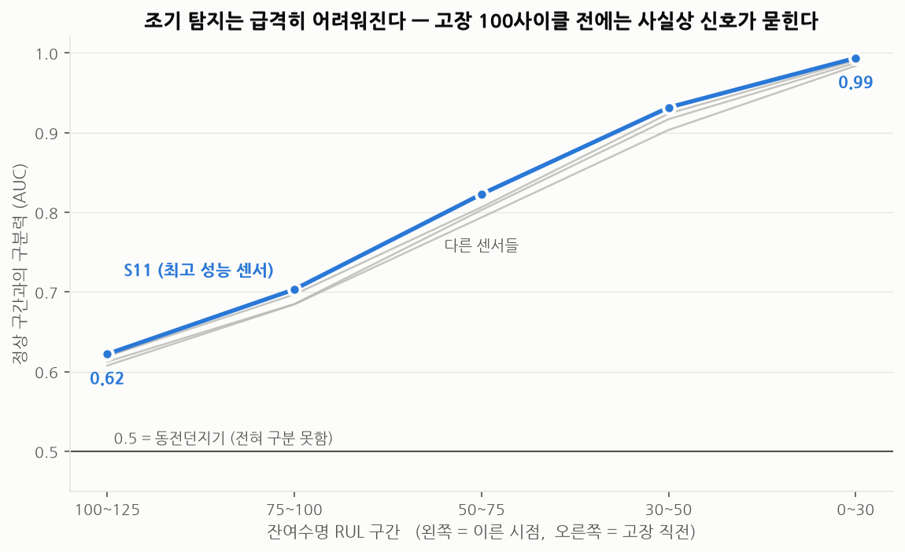

# 1단계 EDA — 센서 데이터에 고장 징후가 남아 있는가

> 재현: `python scripts/01_eda.py`
> 대상: C-MAPSS **FD001** (엔진 100대, 20,631행, 운전조건 1개 / 고장모드 1개)
> 가장 단순한 세트부터 시작합니다. 여기서 안 되는 방법은 FD004 에서도 안 됩니다.

---

## 요약 — EDA 로 알아낸 것

| # | 질문 | 답 |
|---|------|-----|
| Q1 | 같은 기종 설비의 수명은 얼마나 제각각인가? | **128 ~ 362 사이클, 2.8배 차이** |
| Q2 | 센서 21개 중 쓸 만한 것은? | **14개** (7개는 값이 안 변함) |
| Q3 | 열화는 언제부터 눈에 보이는가? | 곡선이 휘기 시작하는 건 **RUL 100 부근부터** |
| Q4 | 센서 하나로 정상/고장을 가를 수 있나? | **가른다. AUC 0.994** — 단, 쉬운 문제였음 |
| Q5 | 얼마나 일찍 알아챌 수 있나? | **고장 100사이클 전 AUC 0.62 — 사실상 못 잡음** |

**핵심 결론: 고장 임박을 맞히는 것은 쉽다. 일찍 알아채는 것이 어렵다.**
이 프로젝트가 실제로 풀어야 할 문제는 Q5 이고, 그것이 이후 단계의 목표가 됩니다.

---

## Q1. 같은 기종인데 수명이 2.8배 차이 난다

동일 기종 엔진 100대인데도 수명이 **최단 128 / 중앙 199 / 최장 362 사이클**입니다.
초기 마모 정도와 제조 편차가 개체마다 다르기 때문입니다.

**이것이 예방보전(PM)의 구조적 한계입니다.**

- 가장 짧은 수명(128)에 맞춰 일괄 교체하면 → **평균 수명의 38%를 버립니다.**
- 평균 수명(206)에 맞추면 → 절반 가까운 설비가 그 전에 고장납니다.

즉 주기 기반 교체는 **낭비 아니면 사고** 둘 중 하나를 고르는 문제입니다.
설비마다 상태를 보고 판단할 수 있다면 이 딜레마를 벗어날 수 있습니다.
이 프로젝트의 존재 이유가 이 그림 한 장에 들어 있습니다.

> **현장 대응**: 공조기 필터를 "3개월마다" 교체하는 것과 같은 구조입니다.
> 층·용도·계절에 따라 실제 막힘 속도는 몇 배씩 차이 납니다.

---

## Q2. 센서 21개 중 7개는 아무 정보가 없다

FD001 에서 **7개 센서는 값이 전혀(또는 거의) 변하지 않습니다.**

| 제외 센서 | 이유 |
|---|---|
| S01, S10, S18, S19 | 값이 완전히 하나뿐 (표준편차 0) |
| S05, S16 | 값이 하나뿐인데 표준편차가 0 이 아님 (아래 함정 참고) |
| S06 | 값이 21.60 / 21.61 두 개뿐, 추세도 미약 (ρ=0.14) |

남은 **14개는 전부 뚜렷한 단조 추세**를 보입니다 (|ρ| ≥ 0.2).

**상승하는 센서**: S11(HPC 출구 정압), S04(LPT 출구 온도), S15(바이패스 비),
S13/S08(팬 회전수), S17(블리드 엔탈피), S02/S03(압축기 출구 온도)
**하락하는 센서**: S12(연료유량/Ps30), S07(HPC 출구 압력), S20/S21(냉각 블리드 유량)

### 물리적으로 무슨 일이 일어나는가

이 데이터의 고장모드는 **HPC Degradation(고압 압축기 효율 저하)** 입니다.
숫자의 움직임을 물리로 읽으면 이렇습니다.

1. 압축기 효율이 떨어져 같은 회전수로 예전만큼 압축을 못 함
2. 제어기가 추력을 유지하려고 **팬/코어 회전수를 올림** (S08, S13 ↑)
3. 더 태우니 **터빈 출구 온도가 올라감** (S04 = T50 ↑)
4. 압축기 출구 온도도 동반 상승 (S02, S03 ↑)

> **3번이 시설관리에서 매일 보는 지표와 같습니다.**
> 항공 정비에서는 이것을 **EGT 마진 감소**라 부르고, 엔진 교체 시점의 주요 판단 근거로 씁니다.
> 냉동기로 치면 **토출가스 온도 상승**, 펌프로 치면 **모터 권선 온도 상승**입니다.
> "같은 일을 하는데 더 뜨거워진다" — 설비 종류와 무관하게 통하는 열화 신호입니다.
>
> 2번도 마찬가지입니다. "같은 풍량을 내려고 팬을 더 빨리 돌린다"는
> 공조기 **필터 막힘 시 인버터 주파수·전류 상승**과 정확히 같은 패턴입니다.

### 겪은 함정 — `std() == 0` 으로 상수 컬럼을 찾으면 안 된다

S05(값이 전부 14.62)와 S16(전부 0.03)은 고유값이 **1개**인데도
표준편차가 정확히 0 이 아니라 `5.3e-15`, `3.5e-18` 로 나왔습니다.
컴퓨터가 소수를 2진수로 근사 저장하면서 2만 건을 누적 계산하는 과정에서
미세 오차가 쌓인 것입니다.

`std() == 0` 으로 검사하면 이 두 개를 놓칩니다.
→ **허용치를 둬야 합니다** (`src/features/select.py` 의 `DEFAULT_TOL = 1e-9`).

---

## Q3. 열화 곡선 — RUL 100 부근부터 휘기 시작한다

엔진 40대를 **고장 시점에 맞춰 정렬**한 그림입니다 (오른쪽 끝 = 고장).
회색이 개별 엔진, 파란색이 전체 중앙값입니다.

읽어야 할 세 가지:

1. **초기 구간(RUL 250~150)은 거의 평평합니다.** 열화가 시작되지 않았습니다.
2. **RUL 100 부근부터 곡선이 휘기 시작**하고, 50 이하에서 급격해집니다.
   → 열화는 선형이 아니라 **가속**합니다. 이것이 예지보전이 가능한 이유입니다.
3. **회색 띠의 두께(개체 간 산포)가 곡선의 상승폭과 맞먹습니다.**
   → 절대값만 보고 "이 엔진은 위험하다"고 말할 수 없다는 뜻입니다. (Q5 로 이어짐)

---

## Q4. 센서 하나로도 정상/고장임박은 갈린다 — 그러나 쉬운 문제였다

정상(RUL > 125)과 고장 임박(RUL ≤ 30)을 비교하면
**센서 하나만으로 AUC 0.994** 가 나옵니다. 거의 완벽한 구분입니다.

여기서 멈추면 "예지보전 성공"이라고 쓸 수도 있습니다.
**하지만 이것은 정직한 평가가 아닙니다.**

- RUL 125 와 RUL 30 은 시간상 아주 멀리 떨어진 두 구간입니다.
- 단조 증가하는 센서라면 당연히 잘 갈립니다.
- **그리고 RUL 30 에서 알아채봐야 이미 늦었습니다.**

실제로 필요한 것은 "지금 고장 직전인가"가 아니라
**"아직 멀쩡해 보일 때 미리 알아챌 수 있는가"** 입니다.

---

## Q5. 진짜 문제 — 일찍 잡으려 하면 급격히 어려워진다

정상 구간(RUL > 125)을 기준으로, **각 RUL 구간을 얼마나 구분할 수 있는지** 측정했습니다.

| RUL 구간 | S11 | S12 | S04 | S07 | 해석 |
|---|---|---|---|---|---|
| 0 ~ 30 | 0.994 | 0.987 | 0.991 | 0.984 | 거의 완벽 — 하지만 이미 늦음 |
| 30 ~ 50 | 0.931 | 0.917 | 0.924 | 0.903 | 잘 잡힘 |
| 50 ~ 75 | 0.823 | 0.803 | 0.806 | 0.793 | 쓸 만함 |
| 75 ~ 100 | 0.703 | 0.685 | 0.697 | 0.684 | 애매함 |
| **100 ~ 125** | **0.622** | 0.612 | 0.619 | 0.608 | **사실상 못 잡음** |

**0.994 → 0.622.** 이 격차가 이 프로젝트가 풀어야 할 문제입니다.

### 왜 어려운가 — 원인을 숫자로 확인

**원인 1: 노이즈. 다만 생각보다 심각하지 않다.**

| 센서 | 전체 열화폭 | 사이클 간 노이즈 | 신호대잡음 |
|---|---|---|---|
| S11 | 0.780 | 0.096 | 8.1배 |
| S04 | 25.645 | 4.004 | 6.4배 |
| S12 | 2.080 | 0.290 | 7.2배 |

한 시점 관측치의 산포가 전체 열화폭의 12~16% 입니다. 무시할 정도는 아니지만,
신호가 노이즈보다 6~8배 크므로 노이즈만이 원인은 아닙니다.

**원인 2: 개체차. 이쪽이 훨씬 크다.**

S11 기준으로, 엔진마다 **출발점 자체가 47.058 ~ 47.658 (폭 0.600)** 로 다릅니다.
그런데 전체 열화폭은 0.780 입니다.

> **개체 간 편차가 열화폭의 77%.**
> 즉 어떤 엔진의 S11 이 47.6 이라는 사실만으로는
> "많이 열화된 엔진"인지 "원래 높게 출발한 멀쩡한 엔진"인지 알 수 없습니다.

이것이 조기 탐지가 어려운 진짜 이유이고, **절대 임계값 방식의 경보가 실패하는 이유**입니다.

> **현장 대응**: "토출온도 80℃ 넘으면 경보" 같은 고정 임계값이
> 설비마다 잘 안 맞는 이유가 정확히 이것입니다.
> 설비마다 정상 상태의 기준선이 다릅니다.

---

## 다음 단계에 반영할 것

EDA 로 확인된 사실이 2단계(건강도 점수) 설계를 결정합니다.

| 확인된 사실 | 설계에 반영할 것 |
|---|---|
| 7개 센서는 정보 없음 | 14개만 사용 |
| 개체차가 열화폭의 77% | **설비별 초기 정상 구간을 기준으로 정규화** |
| 노이즈가 열화폭의 12~16% | 이동평균·이동표준편차 등 구간 특징 사용 |
| 열화가 가속함 (선형 아님) | 변화율(기울기)을 특징으로 추가 |
| 단일 센서로는 조기 탐지 한계 | **14개 센서를 하나의 건강도 점수로 결합** |
| 개체마다 수명이 2.8배 차이 | 절대 사이클이 아니라 **수명 대비 진행률**로 다룸 |

**2단계 평가 기준은 "AUC 0.99"가 아니라 "RUL 100~125 구간의 0.62 를 얼마나 올리는가" 입니다.**
쉬운 구간의 점수는 이미 천장에 닿아 있어 개선 여지가 없습니다.

> 이 단계에서 시도했다가 실패한 것들(이동평균, 개체 baseline 보정의 한계 등)은
> [99_experiments_log.md](99_experiments_log.md) 1단계 항목에 기록했습니다.
