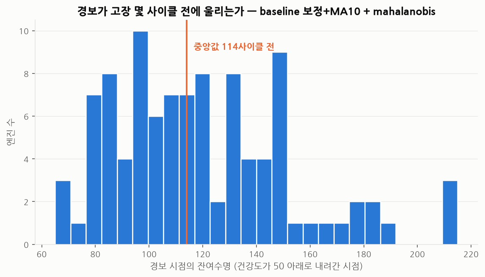

# 2단계 — 건강도 점수 (Health Index)

> 재현: `python scripts/02_health_index.py`
> 대상: C-MAPSS **FD001** · 학습 데이터: **설비별 초기 30사이클만** (RUL 라벨 사용 안 함)

---

## 이 단계의 목표

1단계 EDA 에서 확인한 것:
**고장 임박(RUL 0~30)은 센서 하나로도 AUC 0.99 로 잡힌다. 그러나 이미 늦다.**
개선 여지가 있는 구간은 **RUL 50~100** 이었습니다.

그래서 이번 단계의 목표를 이렇게 정했습니다.

> **RUL 50~100 구간의 구분력을, 센서를 결합해서 얼마나 올릴 수 있는가.**
> 단, **고장 라벨을 전혀 쓰지 않고.**

라벨을 쓰지 않는 이유는 성능을 낮추려는 게 아니라 **현장 적용 가능성** 때문입니다.
실제 회사 설비에는 "고장까지 돌린 기록"이 거의 없습니다.
예방정비 체계에서는 고장 전에 부품을 교체하기 때문입니다.
반면 **정상 운전 데이터는 어느 현장에나 있습니다.**

여기서 정상은 **"설비 도입 후 초기 30사이클"** 로만 정의했습니다.
운전 시간만 있으면 정의되므로, 고장 이력이 없는 설비에도 그대로 적용됩니다.

---

## 결과 요약

| 항목 | 결과 |
|---|---|
| 목표 구간(RUL 50~100) 구분력 | **AUC 0.943** (센서 1개일 때 0.756) |
| 최적 조합 | baseline 보정 + 10사이클 이동평균 + 마할라노비스 거리 |
| 경보 리드타임 | 고장 **114 사이클 전** (중앙값), 최악의 경우에도 82 사이클 전 |
| 경보를 놓친 설비 | **0 / 100대** |
| 오경보율 | 15.8% → 지속 조건 20사이클 적용 시 **5.8%** |

**단일 센서 0.756 → 결합 0.943.** 개선 폭의 대부분은 모델이 아니라 **전처리**에서 나왔습니다.

---

## 1. 무엇을 비교했는가

세 가지 축을 모두 조합해 **20가지**를 같은 조건에서 비교했습니다.

| 축 | 후보 |
|---|---|
| **결합 방법** | z점수 평균 / 마할라노비스 거리 / PCA 재구성오차(주성분 2개) / PCA(분산95%) / Isolation Forest |
| **정규화** | 원본값 그대로 / 설비별 초기값 대비 편차 |
| **평활화** | 없음 / 10사이클 이동평균 |


### 목표 구간(RUL 50~100) AUC 전체 결과

| 전처리 | z점수 평균 | 마할라노비스 | PCA(주성분2) | PCA(분산95%) | Isolation Forest |
|---|---:|---:|---:|---:|---:|
| 원본 | 0.719 | 0.718 | 0.528 | 0.529 | 0.751 |
| 원본 + MA10 | 0.683 | 0.755 | 0.561 | 0.565 | 0.790 |
| baseline 보정 | 0.890 | 0.890 | 0.835 | 0.873 | 0.883 |
| **baseline 보정 + MA10** | **0.943** | **0.943** | **0.939** | 0.708 | 0.934 |

> 기준선: 센서 1개(sensor_11)만 썼을 때 **0.756**

---

## 2. 읽어야 할 세 가지

### (1) 모델보다 전처리가 훨씬 중요했다

가장 좋은 모델(마할라노비스)에 원본을 넣으면 **0.718** 입니다.
가장 단순한 모델(z점수 평균)에 제대로 전처리한 값을 넣으면 **0.943** 입니다.

| 무엇을 바꿨나 | 변화 |
|---|---|
| 모델만 바꿈 (z점수 평균 → 마할라노비스, 원본 그대로) | 0.719 → 0.718 (**변화 없음**) |
| 전처리만 바꿈 (원본 → baseline 보정 + MA10, z점수 평균 그대로) | 0.719 → **0.943** |

EDA 에서 "개체차가 열화폭의 77%"라는 것을 미리 확인했기 때문에
어디를 손봐야 하는지 알 수 있었습니다.
**분석 순서를 지킨 것이 성능으로 돌아온 사례입니다.**

### (2) 이동평균은 조건부로만 효과가 있었다 — 1단계 결론을 뒤집음

1단계에서 이동평균을 단독으로 걸었을 때는 거의 효과가 없었습니다 (0.624 → 0.640).
그래서 "노이즈는 주범이 아니다"라고 결론지었습니다.

그런데 이번에는 결과가 다릅니다.

| 조건 | 이동평균 효과 |
|---|---|
| 원본에 MA10 (마할라노비스) | 0.718 → 0.755 (+0.037, 미미) |
| **baseline 보정에 MA10** (마할라노비스) | 0.890 → **0.943** (+0.053) |

**개체차라는 큰 잡음을 먼저 걷어내야 노이즈 제거가 의미를 갖습니다.**
큰 오차가 남아 있는 상태에서 작은 오차를 다듬어봐야 티가 나지 않습니다.
→ 1단계 결론을 "이동평균은 쓸모없다"에서
**"개체차 보정 이후에 적용해야 효과가 있다"** 로 수정했습니다.

### (3) 마할라노비스와 z점수 평균이 동점이었다

센서 간 상관관계까지 고려하는 마할라노비스가
단순한 z점수 평균과 **똑같이 0.943** 이 나왔습니다.

baseline 보정 + 이동평균을 거치고 나면 14개 센서가 거의 같은 방향으로 움직이기 때문에,
상관관계를 추가로 고려해도 얻을 것이 별로 없었던 것으로 보입니다.

> **선택**: 성능이 같다면 **더 단순하고 설명하기 쉬운 쪽**을 씁니다.
> z점수 평균은 "어느 센서가 몇 표준편차 벗어나서 점수가 이렇게 나왔다"를
> 그대로 보여줄 수 있어, 현장에서 정비원에게 설명하기 훨씬 낫습니다.
> 다만 아래 그림과 수치는 최고점을 기록한 마할라노비스 기준으로 남겼습니다.
> (FD002~FD004 처럼 운전조건이 여러 개인 데이터에서는 결과가 달라질 수 있어
>  3단계에서 다시 확인합니다)

---

## 3. 건강도 점수는 어떻게 생겼나


이상 점수(거리)를 0~100 으로 바꾼 것이 건강도 점수입니다.

```
HI = 100 × 0.5 ^ ( (d - d_정상) / (d_경보 - d_정상) )
```

- `d_정상` = 정상 구간 거리의 중앙값 → **건강도 100**
- `d_경보` = 정상 구간 거리의 상위 5% 지점 → **건강도 50 (경보선)**

그림을 보면 **RUL 250~150 구간은 80~100 에서 완만히 유지**되다가,
**RUL 150 부근부터 뚜렷하게 꺾이고**, RUL 100 부근에서 경보선(50)을 지납니다.
1단계에서 본 열화 곡선의 가속이 하나의 점수로 압축되어 나타납니다.

---

## 4. 경보는 언제 울리는가 — 현장에서 가장 궁금한 숫자



건강도가 50 아래로 내려간 시점을 경보로 보면:

- **100대 전부 경보가 울렸습니다** (놓친 설비 없음)
- 경보 시점의 잔여수명: **중앙값 114 사이클 전**
- 가장 늦게 울린 하위 10% 도 **82 사이클 전**

평균 수명이 206 사이클이므로, **수명의 절반 이상이 남은 시점에 알려주는 셈**입니다.
정비 계획을 세우고 부품을 발주하기에 충분한 시간입니다.

### 그런데 오경보가 문제다

같은 규칙으로 **정상 구간(RUL>125)에서도 15.8%가 경보로 잡혔습니다.**
현장에서 이 수준의 오경보는 치명적입니다.
알람이 몇 번 헛돌면 그다음부터는 아무도 알람을 보지 않게 됩니다.

**대책: 지속 조건(디바운스).** "건강도 50 미만이 N사이클 연속될 때만 경보"


| 지속 조건 | 오경보율 | 경보 리드타임(중앙) | 최악 10% |
|---|---:|---:|---:|
| 1 사이클 (즉시) | 15.8% | 114 | 82 |
| 5 사이클 | 11.8% | 106 | 76 |
| 10 사이클 | 9.2% | 100 | 71 |
| 20 사이클 | **5.8%** | 90 | 61 |

**오경보를 15.8% → 5.8% 로 줄이는 대가는 리드타임 24사이클입니다.**
어느 지점을 고를지는 기술이 아니라 **경영 판단**입니다.
정지 손실이 큰 설비라면 예민하게, 여유 설비가 있다면 둔감하게 잡으면 됩니다.
이 표를 그대로 관리자에게 보여주고 고르게 하는 것이 실무적인 방식입니다.

### 15.8%가 전부 '틀린 경보'는 아니다

한 가지 정직하게 짚을 부분이 있습니다.
이상 점수의 중앙값을 구간별로 보면 이렇습니다.

| 구간 | 이상 점수 중앙값 |
|---|---:|
| 학습 구간 (cycle ≤ 30) | 2.82 |
| 정상 평가 구간 중 cycle 31~60 | 3.72 |
| 정상 평가 구간 중 cycle 61 이상 | **5.67** |
| 고장 임박 (RUL ≤ 30) | 47.34 |

"정상"이라고 라벨을 붙인 RUL>125 구간 안에서도 **점수가 이미 오르고 있습니다.**
즉 15.8% 중 상당 부분은 모델이 틀린 것이 아니라
**우리가 정상이라고 부르기로 한 구간에서 실제로 열화가 시작된 것**일 수 있습니다.

RUL 125 라는 경계는 편의상 정한 값이지 물리적인 경계가 아닙니다.
**"오경보"인지 "이른 탐지"인지는 라벨 정의의 문제이기도 합니다.**
실제 현장이라면 이 구간의 설비를 열어보고 확인해야 답이 나옵니다.

---

## 5. 실제 설비에 적용한다면

이 방식이 현장으로 넘어갈 수 있는 이유는 **고장 라벨이 필요 없기 때문**입니다.

| 필요한 것 | 실제 확보 가능성 |
|---|---|
| 설비별 센서 시계열 | BAS/BEMS 에 이미 있음 |
| 설비 도입 초기 30구간의 정상 데이터 | 있음 (또는 앞으로 쌓으면 됨) |
| 고장 이력 | **불필요** |

적용 절차는 그대로 옮겨집니다.

1. 설비별로 **초기 정상 구간**을 지정 (시운전 안정화 이후 N일)
2. 그 구간의 평균을 각 설비의 **기준선**으로 저장
3. 이후 데이터를 기준선 대비 편차로 바꾸고 이동평균
4. 정상 구간에서 학습한 거리 모델로 **건강도 0~100** 산출
5. 지속 조건을 건 경보 규칙 적용, 임계값은 오경보 허용치에 맞춰 조정

> **주의할 점**: 설비를 정비하거나 부품을 교체하면 기준선을 다시 잡아야 합니다.
> 그러지 않으면 "정비했는데도 건강도가 안 올라간다"는 현상이 생깁니다.
> CMMS(정비이력) 와 연결해 **정비 시점에 기준선을 자동 리셋**하는 구조가 필요합니다.

---

## 다음 단계

건강도 점수는 "지금 얼마나 나빠졌는가"를 알려주지만
**"앞으로 몇 사이클 더 쓸 수 있는가"** 는 답하지 않습니다.
3단계에서는 RUL 을 직접 예측하고, 이 건강도 점수를 입력 특징으로 쓸 때
성능이 얼마나 달라지는지 확인합니다.

> 이 단계에서 실패한 것들(PCA 설정 실수, 건강도 스케일 오설계 등)은
> [99_experiments_log.md](99_experiments_log.md) 2단계 항목에 기록했습니다.
