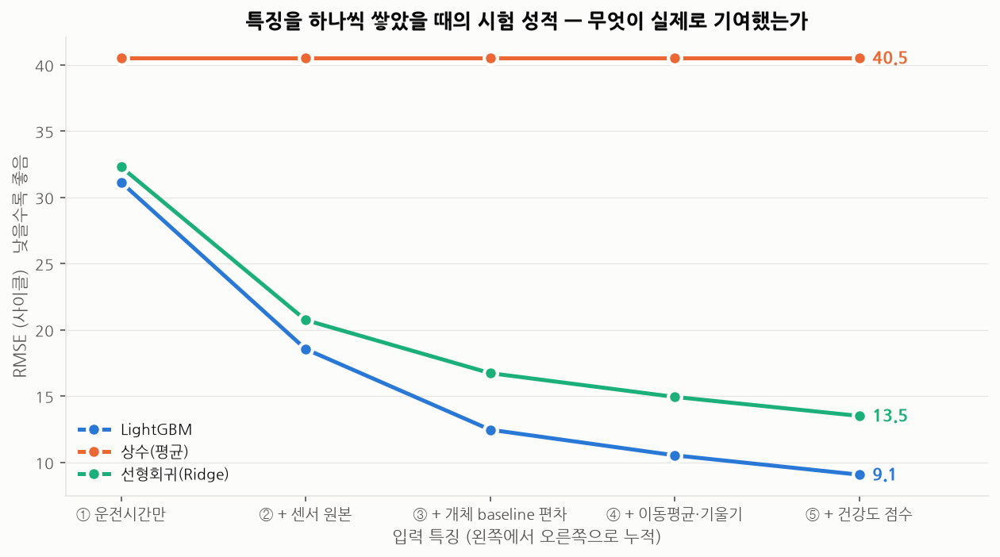
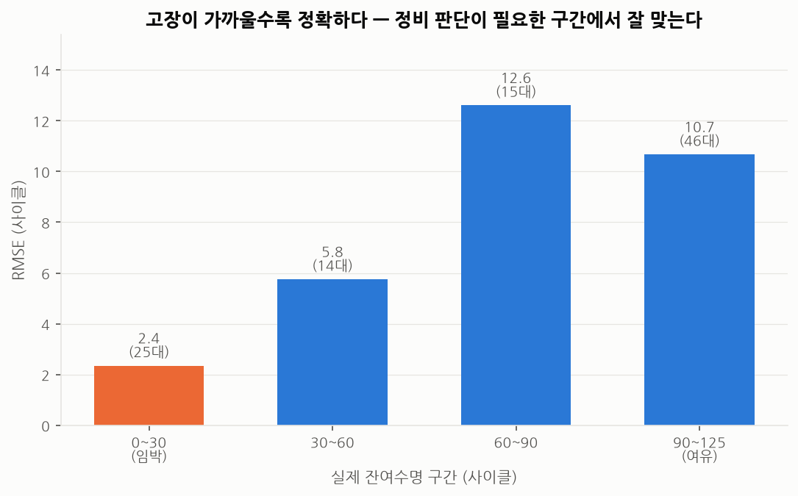
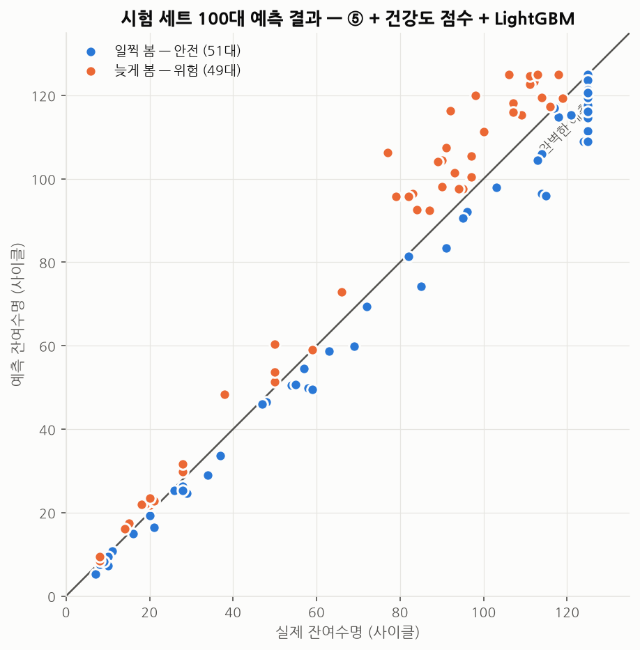
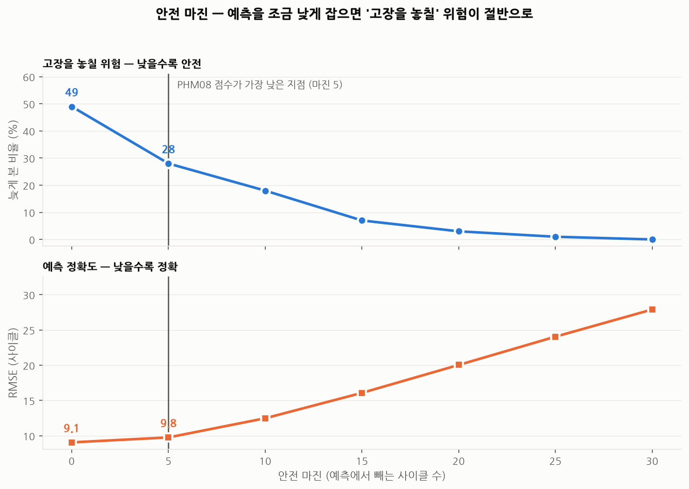

# 3단계 — 잔여수명(RUL) 예측

> 재현: `python scripts/03_rul_model.py`
> 대상: C-MAPSS **FD001** · 시험: 공식 test set 100대의 마지막 시점

---

## 이 단계의 성격 — 앞 단계와 다른 점을 먼저 밝힙니다

| | 2단계 건강도 점수 | 3단계 RUL 예측 |
|---|---|---|
| 답하는 질문 | 지금 얼마나 나빠졌나 | **앞으로 몇 사이클 더 쓸 수 있나** |
| 고장 라벨 | **쓰지 않음** | **씀** |
| 현장 적용 | 바로 가능 | 고장 이력이 쌓인 뒤에나 가능 |
| 이 프로젝트에서의 역할 | 실제로 가져갈 산출물 | **방법론 검증용 벤치마크** |

**이 단계는 "회사에 바로 들고 갈 것"이 아닙니다.**
고장 이력이 없으면 학습 자체가 불가능하기 때문입니다.
대신 공개 벤치마크에서 **"1~2단계에서 만든 특징이 실제로 유효한가"** 를
객관적인 숫자로 검증하는 역할을 합니다.

---

## 결과 요약

| 항목 | 결과 |
|---|---|
| 시험 RMSE | **9.07 사이클** (정답 상한 125 기준) / 10.29 (상한 없음) |
| PHM08 점수 | **130** |
| 아무것도 안 배운 기준선 대비 | 40.51 → 9.07 (**78% 개선**) |
| 고장 임박(RUL 0~30) 구간 RMSE | **3.0 사이클** |
| 최적 조합 | 전체 특징 + 건강도 점수 + LightGBM |

---

## 1. 평가를 먼저 설계했습니다

성능 숫자를 내기 전에 **어떻게 재는지**부터 정했습니다.
1단계에서 "AUC 0.99"에 속을 뻔한 경험 때문입니다.

### (1) 분할은 반드시 설비 개체 단위로

```
잘못된 방법: 전체 행을 무작위로 80:20 분할
    -> 같은 엔진의 100번째 사이클이 학습에, 101번째가 검증에 들어감
    -> 모델이 사실상 정답을 옆에서 보고 맞히는 셈
    -> 성능이 크게 부풀려지고, 실제 새 설비에서는 전혀 안 맞음

올바른 방법: 엔진 번호로 80:20 분할 (src/models/rul.py 의 group_split)
    -> 검증 엔진은 학습에서 한 번도 본 적 없는 설비
```

### (2) 숫자마다 의미를 하나로 고정

| 점수 | 학습 데이터 | 평가 대상 | 용도 |
|---|---|---|---|
| 검증 점수 | 학습 설비의 80% | 나머지 20% 설비 | 어떤 조합을 고를지 판단 |
| **시험 점수** | 학습 설비 100% | **공식 시험 세트** | 최종 성적 |

### (3) 지표를 두 개 씁니다 — RMSE 만으로는 부족

**PHM08 점수**는 늦게 예측한 쪽에 벌점을 크게 줍니다.

| 오차 | 벌점 |
|---|---|
| 30사이클 **일찍** 봄 (= 일찍 정비하러 감) | 9.1 |
| 30사이클 **늦게** 봄 (= 고장을 놓침) | **19.1** |

현장 논리 그대로입니다. 일찍 정비하면 비용이 조금 더 들 뿐이지만,
늦으면 설비가 멈춥니다. RMSE 는 이 비대칭을 보여주지 못합니다.

### (4) 인과성 규칙

모든 특징은 **그 시점까지의 과거만으로** 계산합니다.
설비별 기준선은 초기 30사이클로 잡으므로, 학습·평가 모두 **cycle 30 이후**만 사용합니다.
(실제 현장에서도 "설비를 한동안 돌려 기준선을 잡은 뒤 예측 시작"이 자연스럽습니다)

---

## 2. 특징을 하나씩 쌓으며 기여도를 측정



한 번에 다 넣고 좋은 점수만 보고하면 무엇이 기여했는지 알 수 없습니다.
그래서 **누적**으로 비교했습니다.

### 시험 세트 RMSE (낮을수록 좋음)

| 입력 특징 | 개수 | LightGBM | 선형회귀 | 상수(기준선) |
|---|---:|---:|---:|---:|
| ① 운전시간만 | 1 | 31.15 | 32.30 | 40.51 |
| ② + 센서 원본 | 15 | 18.55 | 20.74 | 40.51 |
| ③ + 개체 baseline 편차 | 29 | **12.47** | 16.74 | 40.51 |
| ④ + 이동평균·기울기 | 71 | 10.53 | 14.94 | 40.51 |
| **⑤ + 건강도 점수** | 72 | **9.07** | 13.51 | 40.51 |

### PHM08 점수 (낮을수록 좋음)

| 입력 특징 | LightGBM | 선형회귀 | 상수 |
|---|---:|---:|---:|
| ① 운전시간만 | 3,749 | 5,742 | 17,947 |
| ② + 센서 원본 | 1,144 | 1,054 | 17,947 |
| ③ + 개체 baseline 편차 | 227 | 436 | 17,947 |
| ④ + 이동평균·기울기 | 171 | 342 | 17,947 |
| **⑤ + 건강도 점수** | **130** | 264 | 17,947 |

### 읽어야 할 것

**(가) 가장 큰 도약은 ② → ③ 구간입니다 (18.55 → 12.47, 33% 개선).**
개체 baseline 편차를 넣었을 때입니다.
1단계 EDA 에서 "개체차가 열화폭의 77%"를 확인해 둔 것이
그대로 가장 큰 성능 개선으로 돌아왔습니다.

**(나) 2단계 건강도 점수가 3단계에도 기여했습니다 (10.53 → 9.07, 14% 개선).**
건강도 점수는 ④의 특징들로부터 계산되는 값이라 새로운 정보는 없습니다.
그런데도 도움이 된 이유는, 트리 모델이 스스로 만들어내기 어려운
**14개 센서의 비선형 결합**을 미리 계산해 준 것이기 때문입니다.
72개 특징 중 **중요도 7위**로 실제로 활용됐습니다.
→ **단계별 산출물이 다음 단계에서 재사용되는 구조**가 확인됐습니다.

**(다) 모델보다 특징이 중요합니다.**
가장 단순한 선형회귀도 특징을 제대로 주면 13.51 까지 갑니다.
특징 없이 LightGBM 만 쓰면(① 운전시간만) 31.15 입니다.
**2단계에서 얻은 결론과 같습니다.**

---

## 3. 누수 검증 — 성능이 너무 좋을 때 반드시 할 일

RMSE 9.07 은 공개 논문에서 보고되는 FD001 성적(대체로 12~16)보다 좋습니다.
**좋은 결과가 나오면 기뻐하기 전에 의심해야 합니다.**
성능이 비정상적으로 좋은 가장 흔한 원인은 실력이 아니라 **데이터 누수**입니다.

### 검증 1 — 라벨을 섞고 다시 학습

특징과 정답의 연결만 끊고 똑같이 학습시켰습니다.
누수가 있다면 라벨을 섞어도 성능이 남아 있습니다.

| | RMSE |
|---|---|
| 정상 학습 | 9.07 |
| **라벨을 무작위로 섞은 뒤** | **39.63** |
| 아무것도 안 배운 기준선 | 40.51 |

→ 라벨을 섞자 기준선 수준으로 떨어졌습니다. **누수 없음.**

### 검증 2 — 검증 점수와 시험 점수의 일관성

| 특징 | 검증 RMSE | 시험 RMSE |
|---|---|---|
| ② + 센서 원본 | 16.4 | 18.6 |
| ③ + baseline 편차 | 11.9 | 12.5 |
| ④ + 이동평균·기울기 | 9.0 | 10.5 |

시험이 검증보다 약간 나쁩니다. 이것이 정상입니다.
(시험이 검증보다 **좋다면** 오히려 뭔가 잘못된 것입니다)

### 그럼에도 논문과 직접 비교하지 않는 이유

두 가지를 정직하게 밝힙니다.

1. **정답 상한 처리가 논문마다 다릅니다.**
   정답을 125로 자르면 9.07, 자르지 않으면 **10.29** 입니다.
   (시험 세트 100대 중 11대가 상한을 넘습니다)

2. **이 프로젝트는 시험 설비의 초기 30사이클로 기준선을 잡습니다.**
   라벨을 쓰지 않으므로 반칙은 아니지만,
   센서값을 전체 평균으로 정규화하는 일반적인 논문 방식보다
   **더 많은 정보를 쓰는 것**은 사실입니다.

따라서 "논문보다 좋다"가 아니라
**"이 평가 조건에서 이 숫자가 나왔다"** 로만 말하는 것이 맞습니다.

---

## 4. 오차가 어디에 몰려 있는가 — 평균보다 중요한 것



전체 RMSE 하나로는 모델의 쓸모를 알 수 없습니다. **어디서 틀리는지**가 중요합니다.

| 실제 잔여수명 | RMSE | 대수 |
|---|---:|---:|
| **0~30 (고장 임박)** | **3.0** | 25대 |
| 30~60 | 7.2 | 14대 |
| 60~90 | 13.9 | 15대 |
| 90~125 (여유) | 12.5 | 46대 |

**고장이 가까울수록 정확합니다.** 이것이 실무적으로 올바른 오차 구조입니다.

- 잔여수명이 100 남았을 때 12사이클 틀리는 것 → 정비 계획에 영향 없음
- 잔여수명이 20 남았을 때 3사이클 틀리는 것 → **정비 일정을 잡을 수 있음**

1단계에서 확인한 "고장이 가까울수록 신호가 뚜렷해진다"가
예측 정확도로 그대로 나타납니다.



점들이 왼쪽 아래(고장 임박)에서는 대각선에 붙어 있고,
오른쪽 위(여유)로 갈수록 흩어집니다.

---

## 5. 안전 마진 — 절반이 '늦게' 예측하고 있었다

위 그림에서 주황색 점(**49대**)은 실제보다 잔여수명을 **길게** 본 경우입니다.
현장에서는 이것이 곧 **고장을 놓치는 것**입니다.

그래서 예측값에서 몇 사이클을 빼는 **안전 마진**을 검토했습니다.



| 안전 마진 | RMSE | PHM08 | 늦게 본 비율 |
|---:|---:|---:|---:|
| 0 | 9.07 | 130 | 49% |
| **5** | 9.77 | **123** | **28%** |
| 10 | 12.49 | 167 | 18% |
| 15 | 16.09 | 260 | 7% |
| 20 | 20.04 | 406 | 3% |

**5사이클만 빼도 고장을 놓칠 위험이 49% → 28% 로 줄어듭니다.**
RMSE 는 0.7 나빠지지만 PHM08 점수는 오히려 **좋아집니다**(130 → 123).

> RMSE 만 봤다면 "마진을 주면 성능이 나빠진다"고 결론냈을 것입니다.
> **비용 구조를 반영한 지표를 함께 봐야 올바른 판단이 나옵니다.**

2단계의 경보 임계값과 마찬가지로, 마진을 얼마로 할지는 기술이 아니라
**설비 정지 비용과 조기 정비 비용의 비율**로 정할 문제입니다.

---

## 6. 이 단계가 남긴 것

| 확인된 것 | 근거 |
|---|---|
| 1단계 EDA 의 진단이 옳았다 | 개체차 보정이 가장 큰 성능 개선(33%)을 만듦 |
| 2단계 산출물이 재사용된다 | 건강도 점수 추가로 14% 추가 개선, 중요도 7위 |
| 특징이 모델보다 중요하다 | 선형회귀 + 좋은 특징(13.5) > LightGBM + 나쁜 특징(31.2) |
| 실무적으로 쓸 만한 오차 구조 | 고장 임박 구간 RMSE 3.0 |
| 비용 비대칭을 반영해야 한다 | 안전 마진 5로 위험 예측 절반 감소 |

---

## 다음 단계

지금까지는 전부 **시뮬레이션 데이터(FD001, 운전조건 1개)** 입니다.
4단계에서는 실제 설비 데이터(MetroPT-3, 공기압축기)로 옮겨
**"항공기 엔진에서 만든 방법이 진짜 기계설비에서도 동작하는가"** 를 확인합니다.
운전조건이 6가지인 FD002/FD004 에서의 성능 변화도 함께 봅니다.

> 이 단계에서 겪은 문제들은
> [99_experiments_log.md](99_experiments_log.md) 3단계 항목에 기록했습니다.
