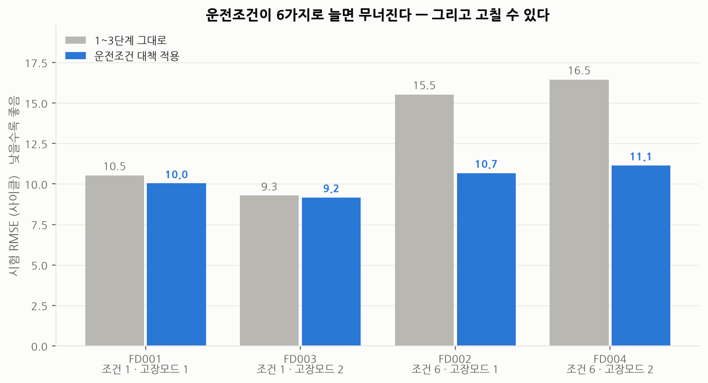
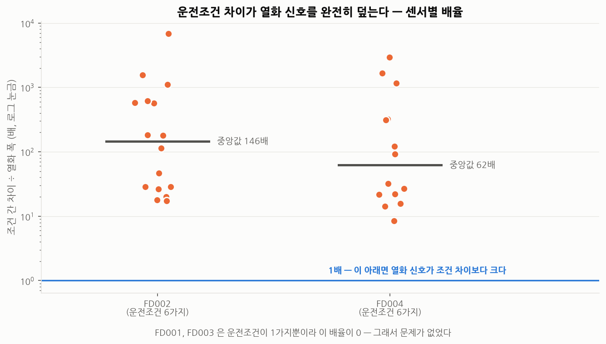
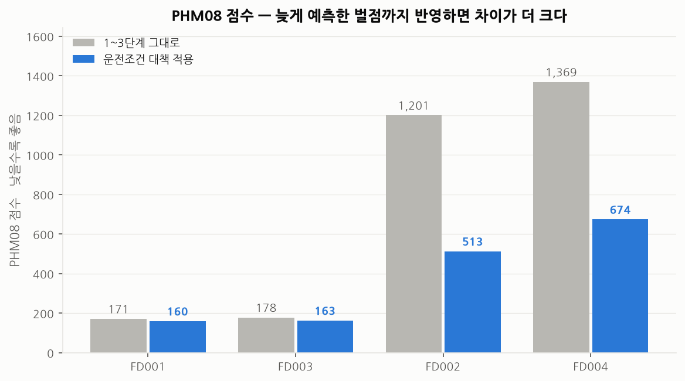
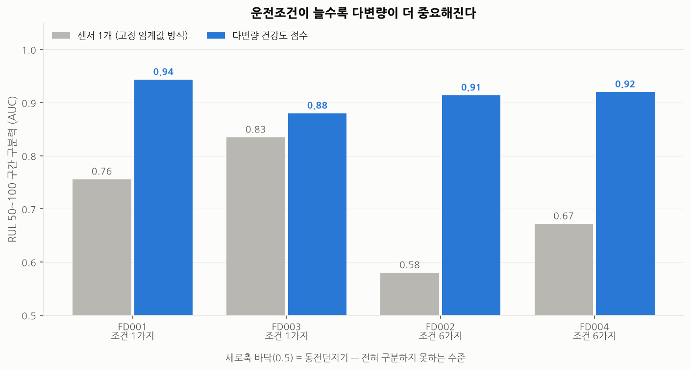

# 4단계 — 조건이 바뀌어도 견디는가 (일반화 검증)

> 재현: `python scripts/04_generalization.py`
> 대상: C-MAPSS **FD001 / FD002 / FD003 / FD004** 전체

---

## 왜 이 단계가 필요한가

1~3단계는 전부 **FD001** 에서 만들었습니다.
운전조건 1가지 / 고장모드 1가지 — C-MAPSS 에서 가장 단순한 세트입니다.

**실제 회사 설비는 이렇지 않습니다.**
공조기는 외기온과 부하율에 따라 운전점이 계속 바뀌고,
고장 유형도 필터 막힘·벨트 이완·베어링 마모 등 여러 가지입니다.

그래서 이 단계에서 묻습니다.

| 질문 | 확인 방법 |
|---|---|
| Q1. 다른 세트에 그대로 적용하면 어떻게 되는가? | FD002/FD003/FD004 에 파이프라인 그대로 실행 |
| Q2. 무너뜨린 것은 고장모드인가 운전조건인가? | 두 요인이 분리된 4개 세트로 비교 |
| Q3. 고칠 수 있는가? | 원인에 맞는 대책을 만들고 재측정 |

C-MAPSS 4개 세트는 이 두 요인이 깔끔하게 분리되어 있어서
**원인을 하나씩 떼어내 볼 수 있는 구조**입니다.

| 세트 | 운전조건 | 고장모드 |
|---|:---:|:---:|
| FD001 | 1 | 1 |
| FD003 | 1 | **2** |
| FD002 | **6** | 1 |
| FD004 | **6** | **2** |

---

## 결과 요약

| 항목 | 결과 |
|---|---|
| 고장모드가 2개로 늘었을 때 | **문제 없음** (FD003: 9.28, FD001 보다 오히려 좋음) |
| 운전조건이 6개로 늘었을 때 | **무너짐** (RMSE +47~56%, PHM08 **7~8배**) |
| 원인 | 조건 간 센서값 차이가 열화 폭의 **중앙값 62~146배** |
| 대책 적용 후 | FD002 15.53 → **10.68**, FD004 16.45 → **11.14** |
| 건강도 점수(라벨 없는 산출물) | 조건이 늘어도 **버팀** (0.91~0.92) |

---

## 1. Q1·Q2 — 무엇이 무너뜨렸는가

1~3단계 코드를 **한 줄도 고치지 않고** 네 세트에 돌렸습니다.



| 세트 | 운전조건 | 고장모드 | RMSE | PHM08 |
|---|:---:|:---:|---:|---:|
| FD001 | 1 | 1 | 10.53 | 171 |
| **FD003** | 1 | **2** | **9.28** | 178 |
| **FD002** | **6** | 1 | **15.53** | **1,201** |
| **FD004** | **6** | **2** | **16.45** | **1,369** |

**답이 명확합니다.**

- **고장모드가 2개로 늘어난 FD003 은 전혀 문제가 없었습니다.** 오히려 FD001 보다 좋습니다.
  → 열화 유형이 여러 개여도 "정상에서 벗어난 정도"를 보는 방식은 그대로 작동합니다.
- **운전조건이 6개인 FD002/FD004 에서만 무너졌습니다.**
  RMSE 는 47~56% 나빠지고, **PHM08 점수는 7~8배**로 뛰었습니다.

PHM08 이 RMSE 보다 훨씬 크게 나빠진 것에 주목할 필요가 있습니다.
단순히 부정확해진 게 아니라 **늦게 예측하는(고장을 놓치는) 쪽으로 틀리기 시작**했다는 뜻입니다.

---

## 2. 원인 — 조건 차이가 열화 신호를 완전히 덮는다



센서별로 **(조건 간 평균 차이) ÷ (열화로 인한 변화 폭)** 을 재봤습니다.
두 값 모두 같은 조건 안에서의 표준편차로 나눠 무차원으로 만들었습니다.

| 세트 | 중앙값 | 최대 |
|---|---:|---:|
| FD001 / FD003 (조건 1가지) | 0배 | 0배 |
| **FD002** | **146배** | 6,848배 |
| **FD004** | **62배** | 2,962배 |

**조건에 따른 변화가 열화보다 60~150배 큽니다.**

이 상태로 "센서값이 평소보다 높다"를 찾으면
열화가 아니라 **지금 어떤 조건으로 돌고 있는지**를 찾게 됩니다.

> **현장으로 옮기면 이런 이야기입니다.**
> "오늘 공조기 소비전력이 평소보다 높다" — 열화인가, 그냥 외기온이 높은 날인가?
> 외기온 5℃일 때와 30℃일 때의 전력을 그냥 비교하면 안 됩니다.
> **조건이 같을 때끼리 비교해야 합니다.**

### 두 번째 원인 — 기준선 창이 관측보다 길었다

FD002 시험 세트에는 관측이 **21사이클뿐인 엔진**이 있었습니다.
기준선을 30사이클로 고정해 두었으니, 이 엔진은 **관측 전체가 기준선**이 됩니다.
"자기 자신 대비 편차"가 항상 0 이 되어, 모델은 이 엔진을 영원히 건강하다고 판단합니다.

| 세트 | 기준선(30)보다 짧은 시험 설비 |
|---|---:|
| FD001 / FD003 | 0대 |
| FD002 | 6대 |
| FD004 | **11대** |

FD001 에서는 가장 짧은 엔진이 31사이클이라 **우연히 문제가 드러나지 않았습니다.**
데이터를 하나만 보고 정한 값은 이렇게 조용히 깨집니다.

---

## 3. Q3 — 대책과 회복

### 대책 1: 운전조건별 정규화 (순서가 중요)

```
1. 운전조건을 식별한다            (외기온/부하율 구간을 나누는 것과 같음)
2. 조건별 평균·표준편차로 정규화   <- 조건 효과를 먼저 제거
3. 그 다음 설비별 기준선을 잡는다   <- 남은 것이 순수한 개체차 + 열화
```

**2번을 건너뛰고 3번을 하면 안 됩니다.**
설비 기준선이 "이 설비가 주로 어떤 조건으로 돌았는지"를 담게 되어 의미가 없어집니다.

조건별 통계는 **설비 한 대가 아니라 전체 설비에서** 구합니다.
한 대의 초기 구간만으로는 조건 6개 × 센서 19개의 통계를 낼 표본이 모이지 않습니다
(실제로 어떤 엔진은 특정 조건이 초기에 1번밖에 안 나옵니다).
조건에 따른 센서 반응은 개체와 무관한 물리 특성이므로 전체에서 구해도 됩니다.

### 대책 2: 설비 길이에 맞춘 기준선

고정 30사이클 대신 **그 설비 전체 길이의 30%** (최소 5, 최대 30)로 잡습니다.
관측이 짧으면 기준선도 짧게 잡되, 예측할 구간은 반드시 남깁니다.

### 결과

| 세트 | 그대로 | 대책 적용 | 변화 |
|---|---:|---:|---:|
| FD001 | 10.53 | 10.03 | -5% |
| FD003 | 9.28 | 9.17 | -1% |
| **FD002** | **15.53** | **10.68** | **-31%** |
| **FD004** | **16.45** | **11.14** | **-32%** |



PHM08 점수로 보면 회복 폭이 더 큽니다.

| 세트 | 그대로 | 대책 적용 | 변화 |
|---|---:|---:|---:|
| FD002 | 1,201 | **513** | **-57%** |
| FD004 | 1,369 | **674** | **-51%** |

**FD002/FD004 가 FD001 과 거의 같은 수준(10.7 / 11.1 vs 10.0)까지 회복했습니다.**
그리고 조건이 1가지인 FD001/FD003 에서는 대책이 **해를 끼치지 않았습니다.**

---

## 4. 예상과 달랐던 것 — 건강도 점수는 애초에 무너지지 않았다

RUL 예측이 무너졌으니 건강도 점수(2단계 산출물)도 무너졌을 것이라 예상했습니다.
**틀렸습니다.**



RUL 50~100 구간 구분력(AUC):

| 세트 | 센서 1개 | **다변량 건강도** | 조건 대책 적용 |
|---|---:|---:|---:|
| FD001 (조건 1) | 0.756 | **0.943** | 0.943 |
| FD003 (조건 1) | 0.835 | **0.880** | 0.862 |
| **FD002 (조건 6)** | **0.580** | **0.914** | 0.907 |
| **FD004 (조건 6)** | **0.672** | **0.920** | 0.903 |

### 읽어야 할 두 가지

**(가) 조건이 6가지가 되면 센서 하나짜리는 완전히 무너집니다 (0.580 = 거의 동전던지기).**
그런데 다변량 건강도는 **0.914 를 유지**합니다.
차이가 FD001(+0.19)보다 FD002(+0.33)에서 **더 커집니다.**

> **이것이 이 프로젝트에서 실무적으로 가장 중요한 결론입니다.**
> 운전조건이 계속 바뀌는 실제 설비일수록 **고정 임계값 경보는 쓸모가 없어지고,
> 다변량 건강도 방식의 가치는 오히려 커집니다.**
> "토출온도 80℃ 넘으면 알람"이 현장에서 잘 안 맞는 이유가 숫자로 확인된 셈입니다.

**(나) 조건 대책이 건강도에는 도움이 되지 않았습니다** (오히려 0.914 → 0.907 로 미세하게 하락).

이유를 추정하면, 건강도 점수는 이미 조건 효과를 상당 부분 흡수하고 있었습니다.
10사이클 이동평균이 여러 조건을 걸쳐 평균을 내고,
설비별 기준선도 여러 조건이 섞인 구간에서 잡히기 때문입니다.
게다가 AUC 는 순위만 보는 지표라, 조건이 만드는 산포가 정상군과 열화군에
비슷하게 얹히면 순위가 크게 흔들리지 않습니다.

→ **대책은 무너진 곳에만 적용합니다.**
   안 무너진 곳에 적용하면 얻는 것 없이 복잡도만 늘고, 조금 손해를 볼 수도 있습니다.

---

## 5. 이 단계가 남긴 것

| 확인된 것 | 근거 |
|---|---|
| 열화 유형이 늘어도 방법은 유지된다 | FD003(고장모드 2개) 문제 없음 |
| 운전조건 변화가 진짜 위험 요인이다 | FD002/FD004 에서만 붕괴, 조건이 열화의 62~146배 |
| 원인을 알면 고칠 수 있다 | 조건별 정규화로 FD001 수준까지 회복 |
| 하나의 데이터로 정한 값은 조용히 깨진다 | 기준선 30사이클이 FD002/FD004 에서 17대를 망가뜨림 |
| **다변량 방식은 조건 변화에 강하다** | 센서 1개 0.58 vs 다변량 0.91 |
| 대책은 필요한 곳에만 | 건강도에는 적용해도 이득 없음 |

---

## 6. 남은 한계 — 여전히 시뮬레이션 데이터다

정직하게 밝힙니다. **4개 세트 모두 C-MAPSS 시뮬레이션입니다.**

운전조건과 고장모드가 늘어난 조건에서 검증했지만,
실측 데이터에만 있는 다음 문제들은 아직 확인하지 못했습니다.

| 실측에만 있는 문제 | 이 프로젝트에서 다뤘나 |
|---|---|
| 결측치, 통신 두절 | ✗ |
| 센서 자체의 고장·드리프트 | ✗ |
| 정비·부품교체로 인한 기준선 변화 | ✗ (문서로만 대응 방안 기술) |
| 라벨(정비 이력)의 부정확함 | ✗ |

원래 계획했던 **MetroPT-3**(실제 지하철 공기압축기, 1,516만 행)로
이 부분을 검증하려 했으나, 현재 환경에서 UCI 서버 접속이 불가능해 보류했습니다.
데이터를 확보하면 실행할 수 있도록 다운로드 스크립트와 절차는 저장소에 준비해 두었습니다.

```bash
python -m src.data.download --dataset metropt3
```

적용 절차는 이 문서 3장과 동일합니다.
MetroPT-3 의 APU(공기압축기)는 압축기 토출압력·오일온도·모터전류를 측정하므로,
**운전조건 = 압축기 부하 상태**로 두면 그대로 이식됩니다.

> 이 단계에서 겪은 문제들은
> [99_experiments_log.md](99_experiments_log.md) 4단계 항목에 기록했습니다.
