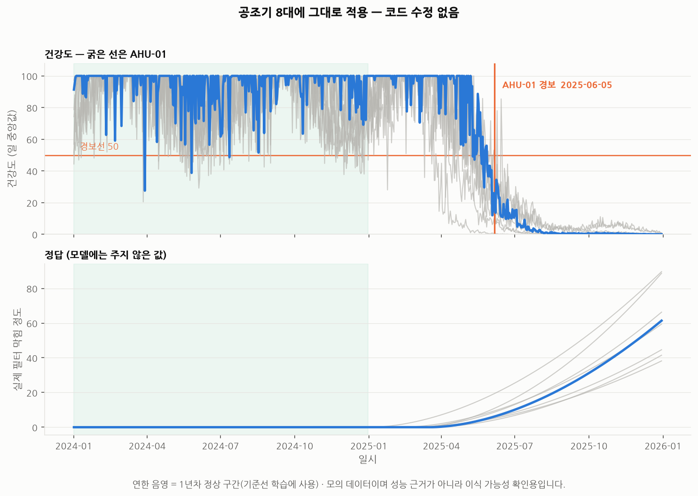

# 5단계 — 실제 설비에 적용하기

> 재현: `python scripts/05_field_application.py`
> 코드: `src/deploy/pipeline.py` (설비 종류와 무관한 감시 파이프라인)

---

## 이 단계가 증명하는 것

1~4단계는 전부 항공기 엔진 데이터였습니다.
포트폴리오에서 가장 자주 받을 질문은 이것입니다.

> "항공기 엔진으로 했는데, 우리 공조기에도 되나요?"

말로 답하는 대신 **코드를 한 줄도 고치지 않고 공조기 데이터에 돌려서** 답했습니다.

| | C-MAPSS (1~4단계) | 공조기 (5단계) |
|---|---|---|
| 설비 | 항공기 터보팬 엔진 | 공조기(AHU) 8대 |
| 컬럼 이름 | unit, cycle, sensor_01… | 설비번호, 일시, 필터차압… |
| 센서 | 21개 (온도·압력·회전수) | 6개 (급기온도·차압·전류·RPM…) |
| 시간 단위 | 운전 사이클 | 1시간 |
| 운전조건 | 고도·마하수 (이산 6가지) | 외기온·부하율 (연속값) |
| 열화 | 압축기 효율 저하 | 필터 막힘 |

**바꾼 것은 설정 한 덩어리뿐입니다.**

```python
spec = EquipmentSpec(
    id_col="설비번호",
    time_col="일시",
    sensor_cols=["급기온도", "환기온도", "필터차압", "팬전류", "팬회전수", "냉수밸브개도"],
    condition_cols=["외기온", "부하율"],
)
monitor = EquipmentHealthMonitor(spec).fit(정상이력)
result = monitor.score(신규데이터)
```



> **이 데모의 데이터는 제가 만든 모의 데이터입니다.**
> 물리 관계를 직접 넣어 만들었으므로 잘 맞는 것이 당연합니다.
> **성능에 대한 근거가 아닙니다.** 성능 근거는 오직 1~4단계의 C-MAPSS 실험입니다.
> 이 단계가 보여주는 것은 **이식 가능성**뿐입니다.

---

## 1. 최소 데이터 요구사항

파이프라인에 `check_data()` 로 넣어 둔 조건입니다.
**모델을 만들기 전에 이것부터 확인해야 합니다.**
현장에서 가장 흔한 실패는 모델이 나빠서가 아니라 애초에 안 되는 데이터로 시작해서입니다.

| 조건 | 최소 기준 | 왜 |
|---|---|---|
| **설비 식별자** | 필수 | 개체별로 기준선을 잡아야 함 (1단계: 개체차가 열화의 77%) |
| **시각** | 필수, 순서 보장 | 시계열이 아니면 열화 추적 불가 |
| **센서 개수** | 최소 3개, 권장 6개 이상 | 4단계: 조건이 바뀌면 단일 센서는 AUC 0.58로 붕괴 |
| **정상 이력 길이** | 기준선 구간 + 감시 구간 | 기준선만 있고 감시 구간이 없으면 편차가 항상 0 |
| **계절 설비의 기준선** | **최소 1년** | 겨울만으로 기준을 잡으면 여름이 전부 이상 (아래 함정 1) |
| 고장 이력 | **불필요** | 정상 데이터만으로 학습 (2단계 설계 원칙) |
| 결측률 | 센서당 30% 이하 | 그 이상이면 그 센서는 제외 |

---

## 2. 어떤 태그를 뽑아야 하는가

BAS/BEMS 에서 실제로 뽑을 수 있는 포인트 기준입니다.
**"입력 대비 산출"** 쌍이 들어가는 것이 핵심입니다.
열화는 대개 "같은 결과를 내는 데 더 많은 입력이 필요해지는" 형태로 나타나기 때문입니다.

### 공조기 (AHU)

| 구분 | 태그 | 열화 시 방향 |
|---|---|---|
| 운전조건 | 외기온, 실내 설정온도, 부하율/재실률 | — |
| 산출 | 급기온도, 환기온도, 급기 정압 | |
| 입력 | 팬 전류, 팬 회전수(인버터 주파수) | **상승** |
| 상태 | **필터 차압**, 냉수밸브 개도 | **상승** |

> 핵심 조합: **"같은 풍량인데 전류·회전수가 오른다" = 필터 막힘**
> 이것은 C-MAPSS 의 "같은 추력인데 회전수·배기온도가 오른다"와 같은 구조입니다.

### 펌프

| 구분 | 태그 | 열화 시 방향 |
|---|---|---|
| 운전조건 | 유량 설정, 계통 부하 | — |
| 산출 | 토출압력, 차압, 유량 | 하락 |
| 입력 | 모터 전류, 인버터 주파수 | **상승** |
| 상태 | 베어링 온도, 진동(가능하면), 씰 누수 | **상승** |

### 냉동기 / 히트펌프

| 구분 | 태그 | 열화 시 방향 |
|---|---|---|
| 운전조건 | 외기온(습구), 냉수 출구 설정온도, 부하율 | — |
| 산출 | 냉수 입출구 온도차, 냉동능력 | 하락 |
| 입력 | 소비전력, 압축기 전류 | **상승** |
| 상태 | **토출가스 온도**, 응축/증발 압력, 과열도·과냉도 | 토출온도 **상승** |

> **토출가스 온도 상승** = 항공기 엔진의 EGT(배기가스온도) 마진 감소와 같은 지표입니다.
> 1단계에서 T50 상승(ρ=+0.77)이 가장 강한 열화 신호 중 하나였던 것과 대응됩니다.

---

## 3. 도입 로드맵

한 번에 전 설비로 가면 실패합니다. 순서가 있습니다.

### 0단계 — 데이터 점검 (1~2주)

```bash
python -c "
from src.deploy.pipeline import EquipmentHealthMonitor, EquipmentSpec
spec = EquipmentSpec(id_col='설비번호', time_col='일시', sensor_cols=[...], condition_cols=[...])
print(EquipmentHealthMonitor(spec).check_data(df))
"
```

여기서 "사용 불가"가 나오면 **모델링으로 넘어가지 말고 데이터부터 고칩니다.**
이 단계에서 실패를 확인하는 비용이 6개월 뒤에 확인하는 비용보다 훨씬 쌉니다.

### 1단계 — 설비 1종 · 소수 대수로 시작 (2~3개월)

- 대상 선정 기준: **동일 기종이 여러 대** 있고, 데이터가 이미 쌓여 있고, 고장 시 손실이 큰 것
- 공조기가 대개 여기 해당합니다 (여러 대 + BAS 포인트 다수 + 정지 시 민원)
- 목표는 정확도가 아니라 **"경보가 실제 정비 필요와 얼마나 맞는지"** 확인

### 2단계 — 경보 임계값 조정 (1~2개월)

이 시점의 산출물은 모델이 아니라 **표 하나**입니다.

| 지속 조건 | 오경보율 | 리드타임 |
|---|---|---|
| 짧게 | 높음 | 김 |
| 길게 | 낮음 | 짧음 |

**어느 지점을 고를지는 기술이 아니라 경영 판단입니다.**
정지 손실이 큰 설비는 예민하게, 여유 설비가 있으면 둔감하게 잡습니다.
이 표를 그대로 관리자에게 보여주고 고르게 하는 것이 실무적인 방식입니다.

### 3단계 — CMMS 연동 (2~3개월)

- 경보 → 작업지시 자동 생성
- **정비 완료 시 그 설비의 기준선 리셋** (아래 함정 2)
- 정비 이력이 쌓이면 "경보가 맞았는지"를 사후 검증할 수 있게 됨

### 4단계 — 확대 및 RUL 도입 (1년 이후)

- 다른 설비 종류로 확대
- 고장·정비 이력이 충분히 쌓이면 3단계의 **RUL 예측**을 얹을 수 있음
- **순서를 뒤집으면 안 됩니다.** RUL 은 고장 라벨이 필요한데 처음엔 그게 없습니다.

---

## 4. 현장에서 반드시 걸리는 함정

전부 이 프로젝트에서 실제로 겪은 것들입니다.

### 함정 1 — 겨울에 기준선을 잡으면 여름이 전부 이상이 된다

**겪은 것**: 공조기 데모를 120일치(1~4월)로 만들었더니
**외기온과 경과시간의 상관이 0.86** 이었습니다.
시간이 갈수록 더워지기만 하니, "더워진 것"과 "열화된 것"을 구분할 방법이 원리적으로 없습니다.
게다가 기준선을 초기 구간에서 잡으니 겨울 데이터만으로 기준을 만들고
**막힘이 시작되기도 전에 경보**가 울렸습니다.

**대응**: 계절을 타는 설비는 **기준선 구간이 최소 1년을 덮어야** 합니다.
그게 안 되면 최소한 기준선이 커버하지 못한 운전 영역을 표시하고 그 구간의 경보는 보류합니다.

### 함정 2 — 정비하면 기준선을 다시 잡아야 한다

필터를 교체하면 차압이 정상으로 돌아옵니다.
그런데 기준선을 그대로 두면 모델은 여전히 "예전 대비 벗어남"을 보고 있습니다.
**"정비했는데 건강도가 안 올라간다"**는 현상이 이래서 생깁니다.

**대응**: CMMS 정비 완료 이벤트에 **기준선 자동 리셋**을 연결합니다.
이것이 3단계에서 CMMS 연동이 필요한 진짜 이유입니다.

### 함정 3 — 평활을 걸면 지속 조건이 무력해진다

**겪은 것**: 시간 단위 데이터라 평활 창을 24시간으로 키우고
경보 지속 조건은 24시간 그대로 뒀습니다.
그랬더니 **8대 중 7대가 열화 시작 1년 전에 경보**를 냈습니다.

평활을 걸면 값이 부드러워지는 대신 **한번 내려가면 오래 머뭅니다.**
정상 구간의 일시적 이탈도 지속 조건을 통과하게 됩니다.

측정해 보니 규칙이 나왔습니다.

| 평활 창 | 지속 조건 | 열화 전 오경보 |
|---|---|---|
| 24시간 | 24시간 (1배) | **7대** |
| 24시간 | 72시간 (3배) | 0대 |
| 72시간 | 72시간 (1배) | 3대 |
| 72시간 | 168시간 (2.3배) | 0대 |

**대응**: 지속 조건은 평활 창의 **3배 이상**으로 잡습니다.
코드에 검사를 넣어 위반하면 경고가 나오도록 했습니다 (`DetectorConfig.__post_init__`).

### 함정 4 — 고정 임계값은 조건이 바뀌면 무너진다

4단계에서 숫자로 확인했습니다.
운전조건이 6가지가 되면 **센서 하나짜리 판정은 AUC 0.580** — 거의 동전던지기입니다.
같은 조건에서 다변량 건강도는 **0.914** 를 유지했습니다.

**"토출온도 80℃ 넘으면 알람"이 현장에서 잘 안 맞는 이유가 이것입니다.**
설비마다, 그리고 운전조건마다 정상의 기준이 다릅니다.

### 함정 5 — "점수가 낮다"만으로는 아무도 안 움직인다

경보에 **원인이 붙어야** 정비원이 확인하러 갑니다.

```
AHU-01 건강도 42  →  팬회전수 +0.7σ, 필터차압 +0.6σ, 급기온도 +0.4σ
                     → "필터 막힘 의심, 차압 확인 요망"
```

`monitor.explain()` 이 이 출력을 만듭니다.
어느 센서가 몇 표준편차 벗어났는지를 크기순으로 돌려줍니다.

---

## 5. 비용 논리 — 왜 할 만한가

1단계에서 확인한 숫자로 설명할 수 있습니다.

동일 기종 엔진 100대의 수명이 **128~362 사이클(2.8배 차이)** 이었습니다.
공조기 필터도, 펌프 임펠러도 마찬가지입니다. 층·용도·계절에 따라 수명이 몇 배씩 다릅니다.

| 방식 | 결과 |
|---|---|
| 가장 짧은 수명에 맞춰 일괄 교체 | **평균 수명의 38% 를 버림** |
| 평균 수명에 맞춰 교체 | 절반 가까이가 그 전에 고장 |
| 상태 기반 교체 | 둘 다 피함 |

주기 기반 교체는 **낭비 아니면 사고** 중 하나를 고르는 문제입니다.
상태를 데이터로 볼 수 있으면 이 딜레마를 벗어납니다.

여기에 5단계 데모 기준으로 **막힘이 최종 수준의 9% 진행됐을 때 경보**가 울렸습니다.
(모의 데이터이므로 숫자 자체는 근거가 아니지만, 조기 경보가 가능한 구조라는 것은 보여줍니다)

---

## 6. 이 프로젝트를 그대로 쓰려면

```bash
# 1) 데이터를 (설비번호, 시각, 센서들, 운전조건들) 형태의 표로 준비
# 2) EquipmentSpec 에 컬럼 이름만 적기
# 3) check_data() 로 사용 가능 여부 확인
# 4) fit() -> score()
python scripts/05_field_application.py    # 공조기 예시 전체 실행
```

`src/deploy/pipeline.py` 는 설비에 대해 아무것도 모릅니다.
아는 것은 "설비 번호 / 시간 / 센서 여러 개 / (선택) 운전조건" 이라는 **데이터 형태**뿐입니다.

**이것이 이 프로젝트의 결론입니다.**
예지보전 방법론은 설비의 물리적 정체가 아니라 **데이터의 구조**에 의존합니다.
항공기 엔진으로 만들었지만 공조기에서 그대로 돕니다.

> 이 단계에서 겪은 문제들은
> [99_experiments_log.md](99_experiments_log.md) 5단계 항목에 기록했습니다.
